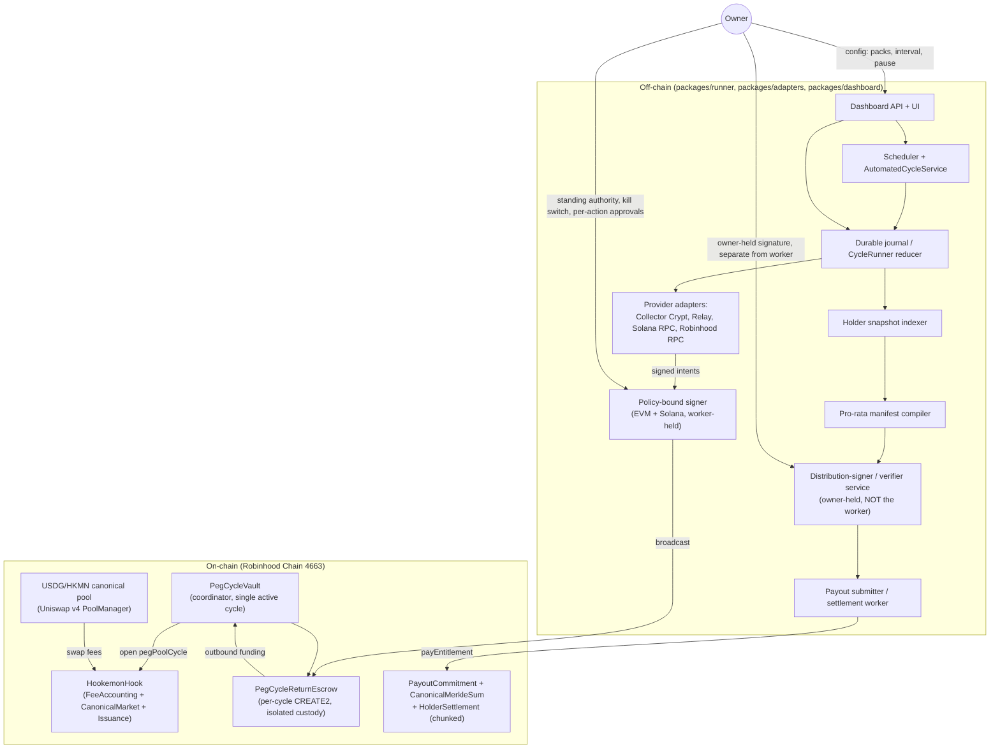

# HKMN Autonomous Peg-Cycle System — Synthesis Design (Revision 58)

Author: synthesis pass over three independently-drafted designs (`design-reuse-first.md`, `design-money-safety-first.md`, `design-product-first.md`) and two independent LLM-judge tournaments over them, per the audit summaries in `scratchpad/w1/summaries/*.json` and the raw findings in `scratchpad/w1/findings/*.json`. Base design: **money-safety-first** (tournament winner, tally 102/98/88 and 48/46/46 across two judge runs). This document grafts the highest-value ideas the judges identified in the other two designs onto that base and resolves every fatal flaw either judge run raised against any of the three — including flaws raised only against the runner-up designs, where the same failure mode could otherwise slip into this synthesis unnoticed.

---

## 1. Summary of the target system

The owner wants a fully autonomous loop on Robinhood Chain (4663): every N minutes (default 20, dashboard-adjustable), a bot buys one Collector Crypt pack with the HKMN swap-fee "process budget," opens it, sells the card via Collector Crypt's standard buyback (not Bybit — Bybit's NFT marketplace closed 2025-04-08 and never handled Collector Crypt cards), bridges Circle USD proceeds from Solana back to Robinhood Chain as USDG via Relay, and pays HKMN holders pro rata — with a dashboard for pack selection, interval control, stuck-cycle recovery, and public community-facing status. The canonical USDG/HKMN pool is coded today as an inclusive 3.00% fee split 0.10% Programmable + 0.40% treasury + 2.50% process, in `FeeAccounting.sol`. **This split is NOT treated as settled in this design.** The owner's transcript said "0.5% treasury," and 0.10+0.40 happens to sum to exactly 0.50 — but that arithmetic coincidence is exactly why it needs to be asked rather than assumed: the transcript wording could equally mean a literal 0.5% treasury bucket with Programmable's 0.10% carved out separately (raising the total above 3.00%, or shrinking process to 2.40%), or the 0.40/0.10 split as currently coded. §11 Decision D9 asks this explicitly and blocks WP-02/WP-21 on the answer; nothing downstream should read this paragraph's first sentence as owner-confirmed.

Today the repository implements this as a manually-triggered, single-cycle, requirements-revision-56 system: `HookemonHook`/`CanonicalMarket`/`FeeAccounting` correctly enforce the 3% split and quadrant math, but omit the fee policy's mandatory cumulative-remainder and 1000-unit-minimum anti-split-swap guards. `PegCycleVault` moves process-budget USDG through a linear EMPTY→FUNDED→OUTBOUND→RETURNED→PAYOUT_COMMITTED lifecycle with an absorbing `FAILED` dead end and no recovery for a partial/degraded return. `PayoutCommitment`/`CanonicalMerkleSum`/`HolderSettlement` implement a real, pull-based Merkle-sum payout capped at 1024 leaves, with no pro-rata computation and no chunking for larger holder sets, plus two small, cheap bugs (a `bytes32(0)` sentinel collision and a hardcoded `1024` literal). `packages/runner` is a durable, hash-chained, compare-and-swap journal/reducer that models the whole buy→open→buyback→return→distribute cycle, but every provider interaction is fixture-only; production Collector Crypt, Relay, and Solana RPC calls are unimplemented. There is no scheduler, no dashboard, and per AGENTS.md/ADR-0018 none is authorized for Phase 1 — automation is explicitly Phase 2, requiring a fresh requirements revision and owner approval.

Two unmerged branches contain most of the missing Phase 2 machinery in different, non-overlapping, partly-conflicting shapes: `codex/phase2-revision-57` adds per-cycle CREATE2 return escrows and a dependency-free local operator-control CLI; `codex/complete-v4-hook` adds an `AutomatedCycleService` (exclusive lease, budget gate, 8-stage driver, policy-bound EVM/Solana signing wallets, fee-settlement observer) but its Solidity changes conflict with main's already-merged `HookemonHook.sol`. Neither branch, nor main, implements a live Collector Crypt/Relay/Solana integration, a scheduler, a dashboard, or pro-rata computation at scale; that combination exists only in the historical, non-authoritative `codex/mainnet-cycle-canary` branch (real API clients, one successful manual one-pack mainnet run), which may inform technique but must be re-implemented clean-room per `product/SOURCE_BOUNDARY.md`. Programmable's launch profile for chain 4663 is verified live today (2026-09-02) as "planned"/"unavailable" — production launch there is not yet possible; only EVM L1 mainnet is launch-authorized on Programmable today.

---

## 2. Architecture

### 2.1 Components

### 2.2 Trust boundaries

The design keeps the 20 trust boundaries already catalogued in `architecture/trust-boundaries.md` (TB-01..TB-20) and **adds none that weaken them**. This is a deliberate, explicit design choice — see Decision D8 below — not an oversight:

- **TB-01 (owner-authorization-to-action)** and **TB-11 (journaled-intent-to-signature-and-broadcast)**: every external mutation still needs a domain-separated, single-use authorization keyed to cycle/action/digest/destination/amount/cap/attempt. Autonomy changes *who* produces that authorization (a policy-bound signer instead of a human) — it does not remove the requirement.
- **TB-08 (process-liability-to-vault-cycle)**: unchanged — Operations (the scheduler's trigger identity) never custodies funds; only the vault/escrow does.
- **TB-16 (vault-return-to-funded-root)**: unchanged, and strengthened — dual-builder, dual-publication Merkle-sum verification stays required for the payout compiler, and (new, §2.3) the second signature is now explicitly an *independent, non-worker-held* key rather than an implicit property of "two copies get built."
- **TB-19 (release-closure-to-live-action)**: fixture evidence and live evidence stay in physically distinct schemas (`hookemon.fixture-*` vs. a new `hookemon.live-*` family) so a fixture run can never be mistaken for a funded one.
- **TB-20 (phase-one-to-future-product)**: this whole design is Phase 2 and requires the requirements-revision-58 process described in §8 before any of it runs live.

**Decision D8, resolved (no new on-chain admin/pause role).** One of the three source designs (product-first) proposed a new on-chain `guardian` pause role on `ProcessBudget`. TB-07 states explicitly that "the minimal caller matrix has no unintended success and no V1 admin, automation, or pause role." A design that revises a named, previously-reviewed security invariant must engage that invariant directly — amend TB-07 itself, with its own rationale — not bypass it by introducing the role through a fresh, uncited boundary list, which is what happened in that design (it never cites TB-01..TB-20 by name). This synthesis does **not** add a guardian role. The kill switch (§2.6) is achieved with mechanisms already inside the reviewed trust-boundary catalogue: an off-chain pause flag plus on-chain key revocation of the vault-authorizer and policy-wallet signers via the already-audited two-step `MoneyRoles.sol` handover. If the owner later wants an on-chain circuit breaker, that is a distinct, explicitly-scoped follow-up that amends TB-07 with its own ADR — not a rider on this design.

### 2.3 Custody and authority model

**Five** distinct identities, none of which is ever the same key. (The base design used four; this synthesis splits out the distribution-signer/verifier explicitly — see rationale below.)

1. **Operations trigger** — the scheduler process's own hot identity. Calls `openPegCycle`/`executeOutbound`-adjacent functions but is contractually forbidden from ever equaling `cycleVaultAccount` or `policyAccount` (enforced today by `packages/runner/src/cycle/bindings.mjs:validateCycleCustody`, carried forward unchanged). It only *triggers*; it never holds principal.
2. **Vault authorizer** — the identity that calls `authorizeFunding`/`authorizePayout`/`recordDegradedReturn` on `PegCycleVault`. A policy-constrained signer (§6), logically separate from Operations. Bounded by the vault balance and the immutable route executor.
3. **Policy-bound execution signer(s)** — one EVM signer and one Solana signer, schema-bound (`allowedDestinations`/`allowedFunctions`/`allowedAssets`/`maxAmount`) per `packages/runner/src/automation/policy-wallets.mjs`. These sign and broadcast the outbound (buy pack) and return (bridge back) legs. They never receive raw key material in their config.
4. **Distribution-signer + independent verifier — owner-held, NEVER the always-on worker.** This is the graft from the product-first design's sharpest specific idea (its §2.3/§2.4 step 11): the identity that approves *which addresses receive an entire cycle's returned proceeds* is the single highest-value action in the whole system, and it must not live on the same always-on host that computes the manifest. Two independent, owner/operator-held keys: a **distribution-signer** (approves the candidate manifest's root hash/root sum) and a **verifier** (independently reconstructs the same tree from the same finalized snapshot and signs a matching receipt) — satisfying TB-16's dual-builder requirement with real key separation, not just "two copies get built by the same process." Neither key is worker-resident; both are invoked on a lower-frequency, semi-manual cadence (§4.7/§11 decision D7). A compromised worker host can therefore never redirect a cycle's payout on its own.
5. **Owner standing-authority key** — a distinct, higher-privilege key that only appears in: (a) the one-time ADR-0021 owner approval granting the automation standing authority, (b) periodic re-approval of spend caps, and (c) the manual, cryptographic "kick a stuck cycle" `supersedeUnobservedIntent` path, which stays deliberately heavy (2-of-2 manual unstick, not a dashboard button).

No key in this list is ever also the Programmable-fee-liability claim key (`0x4957f49620AFf3Adbbe8195a4f633E49cc93376c`, pinned per §3.2) or the treasury claim key — those claim paths stay fully separate and are never automated.

**The always-on worker holds only identities 1, 2, and the Solana leg of identity 3** (per-cycle spend cap + rolling 24h ceiling). It never holds the treasury/programmable claim keys or the distribution-signer/verifier keys. This is the resolution of the single sharpest gap the judges found across the tournament: the reuse-first design folded the vault authorizer into the same automated layer as everything else with no held-back verifier, meaning a single compromised worker host could both compute a fraudulent manifest and authorize its own payout for it. This synthesis closes that gap structurally.

### 2.4 Data flow for one cycle

The return leg and the distribution leg run on separate tracks that only meet at step 9. This is called out explicitly (a prior judge pass flagged the base design's numbering as reading "confusingly on a first pass" because step 9 depended on a later-numbered step 11 with only an inline note) — here the two tracks are split and step 9 is stated as a join, not a forward reference.

**Track A — return leg (numbered, with signer):**

1. **Trigger.** Scheduler's interval timer fires (Operations trigger, no signature — a read/decide step). Calls `decideCycleBudget()` against a live read of the hook's process liability. If `ready:false`, stops and reschedules.
2. **Funding authorization.** Vault authorizer signs a `FundingAuthorization` (per-cycle CREATE2 escrow target, exact amount, expiry, nonce) and submits `authorizeFunding`.
3. **Funding.** Operations trigger calls `ProcessBudget.openPegCycle(cycleId)`; the hook debits process liability and transfers exactly the authorized amount to the per-cycle `PegCycleReturnEscrow`. No human signs this — a contract call moving zero discretionary value (the amount was fixed in step 2).
4. **Outbound bridge.** EVM policy-wallet signer signs+broadcasts a Relay quote-execution (USDG→Solana Circle USD) from the escrow.
5. **Pack purchase.** Solana policy-wallet signer signs+broadcasts Collector Crypt's `generatePack` (Circle USD → pack), instruction-allowlisted.
6. **Open.** Solana policy-wallet signer signs+broadcasts `openPack`; the runner records the finalized on-chain custody delta.
7. **Buyback.** A *separate*, post-open authorization is required (the drawn card is unknown in advance and cannot be pre-authorized). Solana signer signs+broadcasts `buyback`; Circle USD credited to the policy wallet.
8. **Return bridge.** EVM/Solana policy-wallet signers execute the Solana→Robinhood Relay quote, Circle USD→USDG, into the per-cycle escrow's return address. The escrow's live balance is now a *finalized fact* — this is what step 9 waits on.

**Track B — distribution leg (runs concurrently with steps 2-8, gated only on a finalized holder snapshot, not on the return leg):**

B1. The holder snapshot indexer (§4.6) reads finalized `Transfer` logs up to a fixed block and produces an authenticated balance snapshot, excluding pool/hook/vault/every escrow/treasury.
B2. The pro-rata manifest compiler (§4.7) computes `floor(balance_i * proceeds / totalEligibleSupply)` per holder for a *provisional* proceeds figure, tracks dust, and chunks into ≤1024-holder groups if needed. (The exact `proceeds` figure is only known once step 8 finalizes — the compiler recomputes once against the real returned amount before signing; B1/B2 can precompute the snapshot and shares-shape ahead of time so only the final scaling step waits on step 8.)
B3. **Distribution-signer + verifier** (owner-held, §2.3) each independently reconstruct the manifest from the finalized snapshot and the step-8 return amount, and sign matching root-hash/root-sum receipts. This is the one step in the whole cycle that is not fully worker-automated by design.

**Join and settlement:**

9. **Payout authorization.** Once both step 8 (finalized escrow balance) and step B3 (distribution-signer + verifier signatures over that exact `rootSum`) are available, the vault authorizer signs a `PayoutAuthorization` referencing that `rootHash`/`rootSum` and calls `authorizePayout`. Ordinary case: requires the escrow's exact live balance to equal `rootSum` and to be `>= minimumReturnUsdg` (§2.5 covers the two abnormal cases).
10. **Payout funding.** Operations trigger calls `consumePayoutAuthorization`; escrow sends exactly `rootSum` to the hook, which credits one payout liability keyed by `payoutId`.
11. **Settlement.** The settlement worker calls `HolderSettlement.payEntitlement` once per leaf (per chunk if chunked), permissionlessly — any caller may pay any valid proof; this step needs no privileged signature, only gas.

### 2.5 Recovery model

| Situation | Mechanism | Status |
|---|---|---|
| Broadcast succeeded but never observed (RPC dropped, node lag) | `CycleRunner.supersedeUnobservedIntent` — dual independent "not found, finalized" observer proofs + fresh owner-signed authorization | Exists (`codex/complete-v4-hook`), carry forward unchanged |
| Cycle frozen/planned but never started, plan expired | `abandon-expired` (operator CLI) | Exists (`codex/phase2-revision-57`), carry forward |
| Worker crashed mid-cycle | `resume` replays the durable journal from the last committed stage | Exists, carry forward |
| **Pending funding authorization expires before being consumed** (vault authorizer signed `FundingAuthorization`, but the trigger never called `openPegCycle` before the authorization's own expiry) | `cancelExpiredFundingAuthorization` clears the stale authorization so a fresh one can be signed for the same cycle slot | **Already exists on `codex/phase2-revision-57`** (not new) — carried forward unchanged by WP-01. This closes a dead end named in the raw audit findings; it is called out here explicitly, rather than left implicit in §1's branch summary, precisely because a reader who doesn't already know rev57's feature set would otherwise see it as unaddressed. |
| **`FUNDED` with an expired *payout* authorization** (vault reached `FUNDED`, a `PayoutAuthorization` was signed and then expired before `authorizePayout` consumed it — the escrow still holds principal) | Same `cancelExpiredFundingAuthorization`-family renewal path: an expired authorization at any stage is a re-signable nonce, never a state that locks principal by itself. WP-03 adds a regression test proving this specific `FUNDED`+expired-authorization case renews cleanly. | Mechanism exists on rev57 for the funding-side case; **WP-03 extends test coverage to the payout-side case explicitly**, since the raw findings flagged both and only the funding-side one had a named rev57 fix on record. |
| Outbound/return leg failed cleanly, escrow balance is exactly 0 | `recordTerminalFailure` → `authorizeFundingAfterFailure` opens a fresh cycle with a fresh escrow; failed escrow permanently quarantined, CREATE2-isolated | Exists (`codex/phase2-revision-57`), carry forward |
| Outbound/return leg failed cleanly, escrow balance is exactly 0 | `recordTerminalFailure` → `authorizeFundingAfterFailure` opens a fresh cycle with a fresh escrow; failed escrow permanently quarantined, CREATE2-isolated | Exists (`codex/phase2-revision-57`), carry forward |
| Return landed with a **trivial excess** — balance is `>= rootSum` by an amount below a fixed dust threshold (e.g. a 1-unit stray donation, rounding residue) | **Lighter fast path (new, WP-03):** `authorizePayout` accepts `balance >= rootSum` and transfers **exactly** `rootSum`; the excess is left in the escrow for a later, explicit sweep — never silently absorbed into the payout. No `DEGRADED` state, no extra human step, because nothing ambiguous happened: the payout amount is still exactly what the manifest says. This closes the pure stray-donation griefing case (a 1-unit USDG donation locking `authorizePayout` forever) without standing up a full recovery state for it. | **New, WP-03** |
| Return landed **short or ambiguous** — balance is nonzero, below `rootSum`, and either below `minimumReturnUsdg` or otherwise doesn't cleanly satisfy the ordinary path (bridge-fee shortfall, partial Relay fill) | **`DEGRADED` quarantine (new, WP-03):** `recordDegradedReturn(cycleId, receiptDigest, acceptDegraded)` is authorizer-only, callable from `OUTBOUND`, and requires `acceptDegraded=true` on the authorization. **That flag is set only after one additional, explicit human/owner confirmation surfaced by the dashboard as a distinct alert — the vault authorizer must not sign `recordDegradedReturn` from an unattended policy without that confirmation having happened first**, because accepting a short return is an economic judgment call (was this a real loss, a bridge bug, or fraud?), not a mechanical fact. Moves the cycle to a terminal `DEGRADED` state that permanently quarantines the balance (CREATE2-isolated, cannot contaminate the next cycle) and allows a fresh successor cycle. The quarantined balance is never auto-swept anywhere; it is tracked and disclosed on the public status page as a known-loss line item pending owner decision. | **New, WP-03** |
| A holder never claims their entitlement | Pull-based, non-expiring; no sweep needed | By design, acceptable |
| Programmable/treasury claim path drained by a compromised process-budget path | `_requireSolvent` is global across all four liability buckets, so a fully-funded Programmable claim can still revert if process/payout liabilities have drained the shared balance | Known tension, documented; mitigated by keeping the process budget's per-cycle spend cap conservative relative to hook balance |

**Confirmed separately (not a `PegCycleVault` dead end, but the same "runs forever without a fix" class of bug): the runner's cycle store has a hard, in-memory cycle-count ceiling.** Verified by reading `packages/runner/src/cycle/journal.mjs`/`cycle-store.mjs` directly (not inferred from the audit prose): `RECOVERY_LIMITS.storeCycles = 16` and `RECOVERY_LIMITS.journalEvents = 512` are fixture-anti-DoS bounds on `FixtureCycleStore`, an all-in-memory store with no disk persistence and no archiving of closed cycles — every cycle the store has ever known stays resident and counts against the 16-cycle ceiling for the process's lifetime. At a 20-minute default interval this is roughly 5.3 hours of unattended operation (16 cycles × 20 min), not the "about five cycles / 100 minutes" the raw audit finding estimated, but the same fundamental defect: **an always-on scheduler that is supposed to run indefinitely will hit a hard store-cycle-count-exceeded error well within one day of continuous operation**, and the store has no disk-backed recovery path across a process restart either (a crash loses everything, `resume` only replays from what the in-memory store still holds). This is not addressed by simply "carrying forward" WP-01's merge, since neither `main` nor either unmerged branch fixes it. **New WP-27** replaces `FixtureCycleStore` with a disk-backed store for production use: closed/settled cycles are archived to append-only files outside the hot in-memory set (so the live ceiling applies only to *active* cycles, not lifetime history), and the store survives a process restart by reloading from disk rather than depending on the process's memory. WP-07 (automation modules) and WP-14 (scheduler wiring) both depend on WP-27 landing first — the scheduler must not go live against the unmodified fixture store.

### 2.6 Kill switch

Two layers:

1. **Off-chain, immediate:** a `paused` boolean in the operator state file. The scheduler checks it before starting *any* new cycle-triggering call; an in-flight cycle finishes its current stage (never a hard-kill mid-transfer) and then halts. This is the dashboard's pause button.
2. **On-chain, structural:** the vault authorizer and policy-wallet signer keys are the actual capability to move money — revoking or rotating them (two-step handover, already implemented in `MoneyRoles.sol`) is the real kill switch. ADR-0021 (§8) must specify that the owner can revoke this authority unilaterally and immediately, and that revocation is checked by the signer service on every signing request, not cached. Because this is a real key revocation rather than an in-process flag a compromised host could patch around, it is a genuine structural stop — distinct from (and stronger than) a purely software `paused` check enforced inside the same worker it is meant to constrain.

Neither layer is a "true" emergency stop on an in-flight blockchain transaction — nothing recalls a broadcast Solana transaction. The actual safety property: caps stay small (§6 recommends starting at the legacy canary's proven $25–100 one-pack scale), every step is schema-bound before signing, and a paused scheduler plus revoked signer authority stops the *next* cycle from starting.

---

## 3. Contract changes before deployment (file by file)

All on `packages/contracts/src/`. Each needs a requirements-revision-58 REQ change (§8) before implementation, per AGENTS.md R2 (spec sync).

### 3.1 `accounting/FeeAccounting.sol` — close GAP-1 and GAP-2 (HIGH, money-safety)

`_splitLiability` floors each of the 3 buckets independently **per swap** with no persisted remainder, and `CanonicalMarket._fee()` has no lower bound — a direct violation of the mandatory `programmable-fee-policy.md` v1.1.0 ("independent cumulative platform and project remainders for the lifetime of the canonical pool… a positive gross quote amount below 1,000 smallest quote-asset units must revert atomically"). For an unattended bot firing swaps continuously, this is exactly the split-swap bypass the policy exists to close.

Change: add two persisted `uint256` cumulative-remainder accumulators (Programmable and project/treasury+process, matching `standard-fee-kernel.md`'s formula), and a `revert` in `_fee()`/`_splitLiability` for `executedUsdg < 1000`. Updates `FeeAccounting.t.sol`'s existing per-swap-floor-assertion tests. Spec: new `REQ-fee-accounting-6` (cumulative remainder), `REQ-fee-accounting-7` (minimum-quote revert), superseding note against ADR-0016.

### 3.2 `accounting/FeeAccounting.sol` / `HookemonHook.sol` / `bindings/RobinhoodBindings.sol` — pin the Programmable owner, add claim events (GAP-4, MEDIUM)

`fixedProgrammableBeneficiary` and `HookemonHook.ConstructorConfig.programmable` are free constructor parameters, rejected only if zero or self; nothing asserts the deployed value equals the policy-mandated `0x4957f49620AFf3Adbbe8195a4f633E49cc93376c`.

Change: compile-time constant / constructor-time `require` pinning `programmableBeneficiary == 0x4957f49620AFf3Adbbe8195a4f633E49cc93376c`. Add `ProgrammableClaimed`/`TreasuryClaimed` events (`_claimLiability` currently has no `emit`) so the dashboard's status page can index claims without polling. Spec: new `REQ-fee-accounting-8`.

### 3.3 `market/CanonicalMarket.sol` — relax the single-router / mandatory-hookData binding (HIGH, genuine trade-off — see §11 D2)

Today every swap must be routed through the one immutable `swapRouter` and carry an exact 128-byte hookData payload whose `sender` field must equal that same router. The standard Uniswap Trading API, any wallet's default swap flow, and any DEX aggregator all revert against this pool — the community cannot buy HKMN through normal tooling. This "the token cannot be traded with any standard tool" gap is severe for a project explicitly framed as a community token that people are meant to actually buy and hold.

Recommended change: fee accrual does not need hookData — `_accrueAuthenticatedSwap` derives `executedUsdg` from the actual pool delta, not hookData. Make hookData **optional**: when absent or malformed, skip `buyerHkmnCredit` bookkeeping (auxiliary, non-safety-critical, no downstream consumer in `ProcessBudget`/`PayoutCommitment`) but still collect the fee and accrue liabilities normally for *any* caller/router. Full-fill-only enforcement is left unchanged. Spec: revises `REQ-canonical-market-1..2`, needs explicit owner sign-off (§11 D2) and a dedicated red-team pass (WP-26) because it touches an audited, tested invariant.

### 3.4 `process/PegCycleVault.sol` — degraded-return recovery + dust fast path (HIGH, closes the real "stuck forever" case)

Confirmed dead end: `authorizePayout` requires live balance `== rootSum` exactly and `>= minimumReturnUsdg`; `recordTerminalFailure` requires live balance `== 0` exactly. Any bridge-fee shortfall, partial Relay fill, or 1-unit stray donation leaves the cycle permanently wedged with no on-chain path forward.

Change (two-tier, per §2.5): (a) relax `authorizePayout` to accept `balance >= rootSum`, transferring exactly `rootSum` and leaving any trivial excess in the escrow for later sweep — closes the pure-donation griefing case with no new state and no new human step; (b) add `recordDegradedReturn(cycleId, receiptDigest, acceptDegraded)` — authorizer-only, callable from `OUTBOUND` when balance is nonzero but does not satisfy (a) or the exact/minimum condition, gated behind an `acceptDegraded=true` flag that the authorizer may only set after an explicit, separately-logged owner/human confirmation (surfaced by the dashboard, not auto-approved). Moves to a new terminal `DEGRADED` state, quarantined identically to `FAILED`, allowing a fresh successor cycle; the balance is never auto-swept. Spec: new `REQ-process-budget-6`, supersedes the exact-zero clause of ADR-0019's failure handling (new ADR, §8).

### 3.5 `payout/PayoutCommitment.sol` + `settlement/HolderSettlement.sol` — two low-risk bug fixes (LOW, no spec change, fold into WP-04)

Two concrete, cheap correctness fixes found by code audit, neither requiring a behavior change to well-formed inputs:

- **`PayoutCommitment.sol`**: `PayoutAlreadyFunded` is currently keyed by `payoutId != bytes32(0)`, which collides with the zero-value sentinel — a `payoutId` of exactly `bytes32(0)` is indistinguishable from "not yet funded." Fix: an explicit `funded` boolean per record instead of overloading `payoutId != 0`. Add a regression test proving a repeated authorization for `bytes32(0)` reverts `PayoutAlreadyFunded` on the second call instead of silently overwriting.
- **`HolderSettlement.sol`**: a hardcoded `1024` literal duplicates `CanonicalMerkleSum.TREE_WIDTH` instead of referencing it — a latent maintenance hazard if the tree width is ever tuned. Fix: replace the literal with the named constant.

### 3.6 `payout/CanonicalMerkleSum.sol` + `PayoutCommitment.sol` + `HolderSettlement.sol` — chunked payouts beyond 1024 holders (MEDIUM, WP-04)

`TREE_WIDTH` is a hard 1024-leaf ceiling; a single `payoutId`/manifest cannot represent more holders, and nothing chunks a cycle's proceeds across multiple payoutIds.

Change: the funded amount stays keyed by the cycle's single `payoutId` (no change to the money-in-custody step). Add a parent/child structure: **N independent chunk commitments** under that same `payoutId` (`commitPayoutChunk(payoutId, chunkIndex, rootHash, rootSum)`), each an independent depth-10 Merkle-sum tree, contract-enforced `sum(chunk.rootSum) == payoutLiability[payoutId]` exactly before any chunk becomes claimable, and an explicit "manifest closed" flag so a partial/abandoned commitment can never leave holders permanently unpayable. `HolderSettlement.payEntitlement` gains a `chunkIndex` parameter; `paidEntitlements` keys on `(payoutId, chunkIndex, index)`. Highest-risk new contract surface in this design — build and test it now, ship it **inactive** (chunk count fixed at 1) until real holder count approaches 1024 (§11 D5). Spec: new `REQ-payout-commitment-7/8`.

**Gas/size bound, required by `security-and-evidence.md`'s "hard maximums for callbacks, launch, claims, user exits, and keeper actions" rule.** This surface has two unbounded dimensions — up to 1024 leaves per chunk, and an unbounded *number* of chunks per `payoutId` — and neither the money-safety-first base design nor the other two source designs measured either. WP-04 adds a gas-metered test committing and claiming a full, maximally-deep 1024-leaf chunk (worst-case proof depth) and a separate test committing a multi-chunk cycle (a declared maximum chunk count, not an unbounded loop) and measuring the total gas to close out the manifest. The declared maximum chunk count itself becomes a named constant (not left implicit), so the "declared maximum … recipient or position counts" test the security doc asks for has an actual number to assert against.

### 3.7 No contract change needed, but one gets an operational response (confirmed correct, cite for the record)

- **Zero LP fee + live per-swap protocol-fee revert (`CanonicalMarket._matches`): correct, re-checked every swap via `StateLibrary.getSlot0`. Keep the contract as-is — but this is a real, external, governance-controlled brick risk, not a closed finding.** If Uniswap v4 governance ever sets a nonzero protocol fee on this specific pool, every swap starts reverting and the pool is functionally bricked with no on-chain remedy (the hook has no code path that would let it continue operating under a nonzero protocol fee — that is the correct fail-closed behavior per the compatibility standard, not a bug). Reverting on discovery is the right contract behavior; the gap the earlier draft left open was that *nothing watches for it*. Fix, scoped as an addition to WP-16 (Observability) rather than a contract change: poll `StateLibrary.getSlot0`'s protocol-fee field for the canonical pool on every scheduler tick (already reading pool state for the budget-gate check, so this is a free additional field read) and fire the same alert-webhook path used for `DEGRADED`/`FAILED` the moment it goes nonzero, before the next swap even happens to hit the revert. §11 Decision D11 asks the owner how much operational-response investment beyond that alert is worth building now (a documented migration runbook vs. monitoring-only) — this design does not assume an answer.
- Quadrant-dependent return-delta declaration: verified line-by-line against `v4-core/Hooks.sol`'s sign convention; correct. Keep.
- Gross-basis-before-fee-deduction: correct. Keep.
- CREATE2 address self-check against the mined permission mask: correct, matches `compatibility-standard.md`. Keep.
- `_transferUsdg`/`_transferExactUsdg` exact-32-byte-bool + balance-delta checks: correct, fail-closed. Keep — do **not** adopt `codex/complete-v4-hook`'s looser empty-return-accepted variant; that branch's `HookemonHook.sol` is strictly less defensive and must not be merged as-is (§6).
- No new on-chain admin/pause role: deliberate, see §2.2 Decision D8.

### 3.8 `launch/HookemonIssuance.sol` — wire the existing fail-closed guard to a real provider (HIGH, closes the "no HKMN creation path exists" finding)

Read directly (not inferred from the audit summary): `HookemonIssuance.sol` is an **abstract, provider-independent guard** — it deliberately never calls a provider, deploys a token, or transfers value; its own doc comment says a provider adapter may compose it "only after the exact ABI, runtime, decimals, allocation path, and remainder treatment are bound." So the "does not actually create HKMN through the launchpad" finding is not a bug in this file — the file is doing exactly its documented job of refusing to act until something binds it to a real launch. **The gap is that nothing in the repo today is that "something."** Two facts worth stating precisely, since they narrow what's actually still an open decision:

- **Total supply and the market/remainder split are already fixed in code, not open questions.** `WHOLE_HKMN_SUPPLY = 420_690_000_000` (scaled by `decimals`), and `_validatePlan` hard-requires `marketAllocation == 90%` of supply, `remainderAllocation == 10%`, `otherAllocation == 0` — i.e. `plan.projectWallet` must receive **exactly zero** at issuance. There is no owner/treasury pre-mint hiding in this contract; any owner allocation has to come from the swap-fee treasury bucket (§3.1/§3.2), not from token issuance itself.
- **What is genuinely still open:** (a) what `remainderRepresentation` resolves to — the guard only requires it be distinct from `projectWallet`/`canonicalMarket`/`issuanceSource`/`marketPositionCustody`; it could be a vesting/treasury custody contract, a burn address, or a future-incentives escrow, and that choice is not made anywhere in the repo today; (b) the LBP price-curve parameters (starting price, duration/decay schedule) that `CustomLaunchStrategy` (§7/WP-20) actually needs to execute the 90% market allocation as a real liquidity bootstrap, which this guard does not specify at all — it only checks the *destination amount*, not the *curve* that gets it there. Both become **§11 Decision D10**.

Change: WP-20's `CustomLaunchStrategy` is the "provider adapter" this guard's own doc comment calls for. It must (1) call `prepareOfficialIssuance` with a plan matching the fixed 90/10 split and the owner's D10 answer for `remainderRepresentation`, (2) actually perform the mint/allocation through the real `LiquidityLauncher`/`UERC20Factory` path, (3) call `verifyIssuance` with the real observed on-chain balances and a 2-element `TransferRecord` trace proving the market and remainder legs landed exactly as planned. Add a regression test proving `readTokenState().status` reaches `OBSERVATION_VERIFIED_PROVIDER_BINDING_PENDING` only after a real (forked) launch call, never from a hand-constructed observation that wasn't actually produced by the launcher. This closes the "no HKMN token creation path exists" finding as an explicit wiring step, not a silent side effect of building `CustomLaunchStrategy` for other reasons.

---

## 4. Off-chain services (file by file)

New code under `packages/runner/src/` (extends the existing zero-npm-dependency journal/reducer core), a new `packages/adapters/` (the one place real npm dependencies are allowed, §6), and `packages/dashboard/`.

### 4.1 Scheduler (`packages/runner/src/scheduler/scheduler.mjs`, new, ~250 lines)

Dependency-free interval loop (`setInterval`/`unref`'d). Reads `intervalMs` from the operator state file (dashboard-editable, default 1,200,000 = 20 min), checks the pause flag (§2.6), acquires the exclusive lease, and calls `AutomatedCycleService.runOnce()`/`.recoverActiveCycle()`. Surfaces stage/status to observability (§4.10) every tick; never silently swallows a stuck cycle.

### 4.2 Cycle worker (`packages/runner/src/automation/automated-cycle-service.mjs`, port from `codex/complete-v4-hook`, ~200 lines of adaptation)

The existing 189-line `AutomatedCycleService` (lease + budget-gate + 8-stage driver, fully dependency-injected) is kept largely as-is. Rewire its stage list to the escrow-based funding model and its terminal-observation hook to the production reader (§4.5). Add a new stage boundary for the Track-B join (§2.4 step 9) that blocks on both the finalized return amount and the distribution-signer/verifier signatures being present before calling `authorizePayout`.

### 4.3 Provider adapter: Collector Crypt (`packages/adapters/src/collector-crypt.mjs`, new, ~400 lines)

Clean-room implementation of `GET /api/machines`, `POST /api/generatePack`, `POST /api/openPack`, `GET /api/buyback/available`, `POST /api/buyback`, `POST /api/submitTransaction`, `GET /api/pack/status` against `https://gacha.collectorcrypt.com`, `x-api-key` header, exponential-backoff retry, idempotency via the runner's `requestDigest` pattern. Always sends the key even where GET endpoints currently work without one (documented requirement is authoritative). Supports `--dry-run` (real read-only calls, no mutation).

### 4.4 Provider adapter: Relay bridge (`packages/adapters/src/relay-client.mjs`, new, ~350 lines)

`POST /quote/v2`, `GET /intents/status/v3` against `https://api.relay.link`, both legs (USDG↔Solana Circle USD). Supports `--dry-run` (quotes are read-only; no quote executed until live mode). **Beyond a typed client existing, this adapter carries real correctness obligations the scenario-matrix's "External-liquidity aggregation" section names explicitly, and the design states them here rather than leaving WP-09's acceptance criteria as "a client exists":** a quote-vs-execution differential check (the executed amount must be compared against the quoted amount, not blindly trusted, before the return leg is treated as final); callback/status authentication (an `/intents/status/v3` response is only trusted if it authenticates back to the specific intent this adapter submitted, not matched loosely by chain/asset); exact-refund handling (a Relay-side partial fill or refund must produce an exact accounted amount, never an estimate); and reentrancy/venue-failure isolation (a Relay outage or malformed response must fail the adapter call cleanly, never leave the cycle's journal in a state that looks like the bridge succeeded). Critically, **a Relay partial-fill/refund/failure scenario is exercised through the adapter's own failure semantics, not only at the synthetic-fixture level**: WP-09 adds a test that feeds a recorded partial-fill/refund fixture response through the real adapter code path and asserts it produces the same `recordDegradedReturn`-eligible signal that WP-03/WP-23's `DEGRADED` path already handles — closing the gap where the two were previously only linked by manually-authored fixture journal entries that never actually exercised the adapter.

### 4.5 Provider adapter: Robinhood/Solana RPC + contract calls (`packages/adapters/src/robinhood-rpc.mjs`, `solana-rpc.mjs`, `hook-contract-client.mjs`, new, ~600 lines combined)

Thin, viem-based (EVM) and raw-JSON-RPC (Solana) read/write wrappers: contract calls for `openPegCycle`/`authorizeFunding`/`executeOutbound`/`authorizePayout`/`consumePayoutAuthorization`/`recordDegradedReturn`, balance reads, finalized-block transaction/receipt fetches. The one place a real dependency (`viem`) is justified — §6.

### 4.6 Holder snapshot indexer (`packages/runner/src/distribution/snapshot-indexer.mjs`, new, ~350 lines, dependency-free)

Reads HKMN `Transfer` logs from Robinhood RPC up to a fixed finalized block, folds into current balances (not `eth_call` reads — a log-derived snapshot is independently reproducible from the same finalized block, satisfying TB-16's dual-builder requirement). Excludes a fixed, documented address set: pool, hook, vault, every per-cycle escrow (via the same CREATE2 formula the contracts use), treasury. Produces `hookemon.hkmn-holder-snapshot.v1`.

### 4.7 Pro-rata manifest compiler (`packages/runner/src/distribution/pro-rata.mjs`, new, ~250 lines)

Computes `amount_i = floor(balance_i * proceeds / totalEligibleSupply)`, tracks floor-rounding dust and carries it forward into the next cycle's distributable pool (§11 D6). Chunks holders into ≤1024-entry groups (deterministic, sorted by address) when needed, feeding §3.6's chunk-commitment path. Output feeds unmodified into the existing `reconcile.mjs`/`manifest.mjs` verification pipeline.

### 4.8 Distribution-signer / verifier service (`packages/runner/src/distribution/distribution-signer.mjs`, new, ~200 lines) — new package, graft from product-first

A small owner-operated CLI/service, deliberately **not** part of the always-on worker (§2.3), that: (a) as distribution-signer, reads the compiled manifest and the finalized return amount, independently recomputes the root hash/root sum, and signs an approval; (b) as verifier (a second, independent invocation/key), does the same recomputation from the same finalized snapshot and signs a matching receipt. Both signatures are required before `authorizePayout` (§2.4 step 9) is producible. Invoked on a lower-frequency, semi-manual cadence — this is the one step the automation intentionally does not run unattended (§11 D7).

### 4.9 Payout submitter / settlement worker (`packages/runner/src/distribution/settlement-worker.mjs`, new, ~300 lines)

After a distribution is funded, calls `HolderSettlement.payEntitlement` once per leaf/chunk, retry/backoff, tracking `paid`/`unpaid` per leaf in the durable journal. Idempotent by construction (`payEntitlement` itself reverts `EntitlementAlreadyPaid` on retry).

### 4.10 Configuration, secrets & observability (`packages/runner/src/config/`, `packages/runner/src/observability/`, new, ~350 lines combined)

Spend caps, allowlists, and intervals live in the dashboard-editable, versioned, atomically-written operator state file. Secrets never enter that file or the git repo; resolved from an OS keychain or a remote policy-wallet provider's own credential store, referenced only by an opaque handle. Structured JSON logging per stage transition, a `cycle-status` projection for the dashboard, and a minimal alert webhook on `DEGRADED`/`FAILED`/lease-contention.

---

## 5. Dashboard

**Audience:** the owner (full control) and the public (read-only status). No third party gets write access; there is exactly one operator.

**Auth:** owner-authenticated endpoints use a timing-safe-compared bearer credential (single-operator system; a proxy-credential form is simplest). Public endpoints are unauthenticated, read-only, and never leak signer identities, exact holder balances, or in-flight authorization digests before they are safe to disclose.

**API (dependency-free `node:http`):**

| Method & path | Auth | Payload |
|---|---|---|
| `GET /healthz` | public | — |
| `GET /public/api/status` | public | current cycle stage, next scheduled run ETA, last N cycles' outcomes (no amounts pending, no digests) |
| `GET /public/api/community-dashboard` | public | fee split, cumulative distributed-to-holders total, holder count, any quarantined/degraded balances (disclosed, not hidden), contract addresses, on-chain evidence links |
| `GET /api/config` | owner | `{ intervalMinutes, packCodes[], paused, spendCapUsdg }` |
| `PUT /api/config` | owner | partial update, schema-validated |
| `GET /api/packs` | owner | cached Collector Crypt catalog (120s TTL) |
| `POST /api/cycle/pause` \| `/resume` | owner | — |
| `POST /api/cycle/reconcile` | owner | evidence payload |
| `POST /api/cycle/abandon-expired` | owner | — |
| `GET /api/cycle/:id` | owner | full journal/status for one cycle |
| `GET /api/cycles` | owner | paginated cycle history |

Two actions are deliberately **not** dashboard buttons, both requiring an out-of-band signature: `POST /api/cycle/supersede` (kick a stuck cycle — dual-observer proof + fresh owner signature, §2.5) and the distribution-signer/verifier approval (§4.8) — the dashboard surfaces "distribution ready for approval" as a status line, not a click-to-approve control.

**Pages:** owner console (config form, cycle list/detail, pack picker, pause/resume, health); public status page (cycle stage, next-run countdown, cumulative distribution stat, degraded/quarantined balances disclosed, contract-address links).

**Storage:** the durable, money-critical journal stays the existing hash-chained append-only file store. Dashboard-only concerns (cycle-history pagination, cached pack catalog) may use `node:sqlite` as a read-optimized projection rebuilt from the journal, never as a second source of truth for money state.

---

## 6. Dependency and signer decision

**Dependencies — hybrid, isolated by package boundary.** Keep `packages/contracts` and the existing `packages/runner/src/{cycle,distribution,operator}` deterministic core exactly as they are today — zero npm dependencies, Node builtins only, hash-pinned, auditable byte-for-byte. Put all *new* dependencies (`viem` for EVM calls/ABI encoding, `@solana/web3.js` for Solana RPC/transaction construction) exclusively in the new `packages/adapters/` package, which the deterministic core only ever talks to through a narrow, already-proven dependency-injection seam — so `packages/runner`'s own tests keep running with zero installs, and a compromised or vulnerable transitive dependency in `viem`/`@solana/web3.js` cannot reach money-accounting logic without going through the same authorization checks every other caller does. Requires the 3-way coordinated change the control-plane audit flags (workflow file, `product/dependency-pins.json`, `scripts/verify-control-dependencies.mjs`) — scoped as its own early package (WP-06), sequenced before every adapter that needs it, per product-first's concretely-scoped equivalent work package.

Rejected alternative: fully dependency-free hand-rolled EVM/Solana primitives everywhere. Correctly implementing transaction signing/serialization and RPC edge cases by hand is exactly the kind of code where a subtle bug directly costs the owner money; isolating `viem`/`@solana/web3.js` to the adapter boundary captures the supply-chain benefit of the zero-dep core without paying the correctness cost of reinventing chain clients.

Rejected alternative (widen the dependency boundary to the whole runner): considered and rejected — a materially larger supply-chain blast radius for the same money-moving system with no correctness benefit over the isolated-adapter approach, for functionality (`packages/adapters`) that already gets the real dependency where it's actually needed.

**Signer — policy-bound, remote/keychain-backed, never a raw key in application config, and never the distribution-signer/verifier.** The `codex/complete-v4-hook` `EvmPolicyWallet`/`SolanaPolicyWallet` pattern, backed in production by either (a) a remote custodial policy-wallet provider (reimplemented clean-room against that provider's own current API — never copy legacy wiring verbatim) or (b) OS-keychain-backed local signing for initial bring-up, with a hard requirement that whichever is chosen enforces the policy schema itself. Reject the legacy branch's MetaMask-mobile-QR-scan signer entirely — structurally incompatible with unattended operation. Start with the OS-keychain option (§11 D3), migrating to a remote provider once cycle volume justifies it. The distribution-signer/verifier (§4.8) is deliberately excluded from this whole automated signer stack — it is invoked by the owner (or a separate, lower-frequency service under separate custody), never by the scheduler.

---

## 7. Launch path via Programmable on 4663

**Verified today (2026-09-02):** Programmable's discovery document lists chain 4663 ("Robinhood Chain Mainnet") with `status: "planned"`; the v4 capabilities endpoint returns `readiness.status: "unavailable"`, `reasonCodes: ["ROBINHOOD_CHAIN_PROFILE_UNAVAILABLE"]`. Only chain 1 (EVM L1) has `productionLaunchAuthorized: true` today. **Production launch on 4663 is not possible today** — an external dependency outside the repo's control, with no committed ETA.

**Can be prepared now (dry-run, no execution):**
- A `submission.json` per the builder skill's schema, every provider-bound field populated where knowable (fee split, hook permission mask, hookData layout per §3.3, the pinned Programmable owner address per §3.2), `null`/`INTEGRATION_PENDING` elsewhere.
- A full launch plan artifact mirroring `script/release/PhaseOneReleasePlan.sol`'s existing pattern, extended to cover the new escrow and chunked-payout contracts.
- A **custom** `LiquidityLauncher` strategy (the stock `InstantLaunchStrategy` is hookless/native-ETH/fixed-1e9-supply and unusable) — write and test it now against a fork; it cannot deploy until the Robinhood profile is launch-ready.
- CREATE2 hook-address mining, **but only after two preconditions land, not before**: (1) §3.3's hookData relaxation is finalized (mining before that needs re-mining if the permission mask changes), and (2) the Universal Router address discrepancy is resolved by a fresh finalized-RPC probe (see below). Neither this design nor either of the two source designs it was judged against resolves that discrepancy on paper — a dedicated read-only probe (WP-25) closes it before any router-address-bearing artifact is finalized, and WP-20 (mining) is blocked on that probe's output, not just told to "sequence after."

**Waits for external readiness:** the actual `chainDeployment`/`profile` binding and any real submission/registration call to Programmable. Separately: the repo-pinned Universal Router address `0x06afBA43fd06227fA663b0dAeCF536F6eaA6BF99` disagrees with Uniswap's current public deployments page listing `0x8876789976decbfcbbbe364623c63652db8c0904` for chain 4663 (a possible 2026-08-05 redeploy) — this must be resolved via a fresh finalized-RPC probe (WP-25) before any swap-routing or CREATE2-mining code trusts either value; §3.3's router relaxation reduces how load-bearing a wrong pin would be (the pool stops requiring one specific router to function) but does not remove the need to know the correct value for the mining/launch-plan artifacts themselves.

---

## 8. Process artifacts

**Requirements revision 58 outline** (additive to the frozen revision-56/-57 set; supersedes nothing from Phase 1's immutable hook guarantees):

- `REQ-fee-accounting-6`: cumulative Programmable/project fee remainders persist across swaps for the pool's lifetime; a claim never resets them.
- `REQ-fee-accounting-7`: a swap with gross executed-USDG below 1,000 smallest units reverts atomically.
- `REQ-fee-accounting-8`: the Programmable beneficiary is compile-time pinned to the policy owner address; claim events are emitted.
- `REQ-canonical-market-6`: the canonical pool accepts swaps from any caller/router; hookData is optional and, when present and valid, credits `buyerHkmnCredit`.
- `REQ-process-budget-6`: a return `>= rootSum` transfers exactly `rootSum`, leaving any excess for later sweep; a return that is neither that nor zero moves the cycle to a terminal, quarantined `DEGRADED` state (requiring an explicit `acceptDegraded` confirmation) and permits a fresh successor cycle.
- `REQ-payout-commitment-7`: a single cycle's payout liability may be committed as multiple independent chunk manifests, each a depth-10 Merkle-sum tree, whose root sums must exactly total the funded liability before any chunk is claimable.
- `REQ-cycle-control-2` (extends rev 57's `REQ-cycle-control-1`): a scheduler may trigger cycle stages autonomously within an owner-approved standing authority, subject to a per-cycle spend cap, a maximum cycles-per-day cap, and an immediately-effective pause/kill switch.
- `REQ-distribution-1`: a finalized on-chain Transfer-log snapshot is the sole source of holder balances for pro-rata computation; a documented exclusion list removes pool/hook/vault/escrow/treasury addresses.
- `REQ-distribution-2` (new): the manifest that determines payout recipients requires two independent, non-worker-held signatures (distribution-signer + verifier) before it is usable in a `PayoutAuthorization`.
- `REQ-dashboard-2` (a **new** id — REQ-dashboard-1 stays permanently reserved per ADR-0018): a read-only public status surface and an owner-authenticated config/control surface, config-mutation only, no direct fund movement.

**ADR-0021 outline** ("Autonomous cycle authority"): supersedes ADR-0018's "no scheduler" clause and ADR-0019's exact-zero `recordTerminalFailure` clause, *specifically and only* for Phase 2 under a new owner-approved standing authority; states the five-identity custody model (§2.3) including the explicit exclusion of treasury/programmable/distribution-signer keys from the always-on worker, the two-layer kill switch (§2.6), the explicit non-adoption of a new on-chain pause role (§2.2 D8, with the TB-07 citation on record), and that every autonomous action stays schema-bound and journaled exactly as today's manual actions are — autonomy changes who signs, not what is checked.

**Owner-approval drafts needed (unsigned, for the owner to review and sign):** (1) revision-58 baseline approval; (2) standing signing-authority grant naming the exact per-cycle spend cap, max cycles/day, and kill-switch behavior; (3) Phase 2 delivery-boundary opening (flips `product/delivery-boundary.json`'s `phases.2` from `CLOSED` to `OPEN`); (4) approval of the §3.3 hookData-relaxation change specifically, since it alters an already-tested, owner-reviewed invariant; (5) approval of the distribution-signer/verifier custody split (§2.3/§11 D7) and who holds those two keys.

**Delivery-boundary/CI changes:** open phase 2 in `product/delivery-boundary.json`; regenerate the required registries with `deliveryPhase: 2` sidecars for every new record; add the new `packages/adapters` dependency footprint to `product/dependency-pins.json` and `.github/workflows/v4-gates.yml` (3-way coordinated, §6); relax `scripts/lib/ledger.mjs`'s task-deferral restriction (currently hardcoded to `P1-011` only) or mint fresh Phase-2-scoped task ids that don't need deferral at all (recommended — avoids touching that hardcoded gate).

**Task cards:** reserve `codex/phase2-revision-57`'s `P2-001..012` numbering as canonical (§11 D1); continue new work from `P2-013`.

**Docs to update:** new `docs/modules/` cards for `peg-cycle-escrow.md`, `automated-cycle-service.md`, `pro-rata-distribution.md`, `holder-snapshot-indexer.md`, `distribution-signer.md`, `dashboard.md`, `adapters.md`; update `docs/modules/index.json`'s digest registry (and fix the pre-existing stale `cycle-runner.md` digest bug already found on `codex/phase2-revision-57` commit `228d4b1`); update `README.md`/`PRD.md` to describe the Phase 2 loop.

---

## 9. Test and evidence strategy

- **Unit:** extend `FeeAccounting.t.sol`/`PegCycleVault.t.sol`/`CanonicalMerkleSum.t.sol`/`PayoutCommitment.t.sol`/`HolderSettlement.t.sol` for every §3 change (cumulative remainder boundary cases, sub-1000-unit revert, no-hookData swap path, dust-fast-path exact-transfer, `DEGRADED` transition with `acceptDegraded` gating, chunk-commitment sum invariant, sentinel-collision regression, `TREE_WIDTH` literal removal). Extend `packages/adapters` with adapter-level unit tests using recorded fixture HTTP/RPC responses (never live calls in CI).
- **Fixture end-to-end:** extend the existing `packages/runner/test/cycle/*` + `test/distribution/*` suites to drive the pro-rata compiler, distribution-signer/verifier join, and chunked-payout path through the same fixture harness, keeping the dual-copy/dual-signature Merkle verification intact.
- **Forked/anvil integration for the hook path — two distinct suites, not one.** `security-and-evidence.md` requires a block-pinned reproducible fork for review/regression *and* a separate current-head smoke test; a single `--fork-url` run (implicitly current-head, as an earlier draft of this design had it) satisfies neither requirement fully. WP-24 ships both: (1) `RobinhoodV4Fork.t.sol` forked at a fixed, recorded block number — deterministic, reviewable, safe to re-run byte-for-byte in CI on a schedule, the suite a reviewer actually reads; (2) a separate `RobinhoodV4ForkSmoke.t.sol` run against current head (no pinned block) whose only job is to catch drift between the pinned-block assumptions and live chain state — non-blocking in CI, its failure means "go re-pin the block and investigate," not "the hook is broken." Both extend `RobinhoodV4PoolManager.t.sol`'s existing pattern (already deploys a real `PoolManager`/`PositionManager` from the pinned Uniswap submodules).
- **Dry-run mode against real read-only RPC/APIs:** every provider adapter supports a `--dry-run` flag performing real reads (quotes, balance reads, RPC probes) but refusing any call that would sign or broadcast, returning a structured "would have done X" record instead. A standalone `scripts/verify-phase2-readiness.mjs` (modeled on `feasibility/verify-robinhood-binding.mjs`'s existing fail-closed pattern) re-probes Collector Crypt's `/api/status`+`/api/machines`, Relay's `/chains`, Programmable's discovery/capabilities endpoints, and the Uniswap deployments page, comparing against the pinned bindings and reporting `INTEGRATION_PENDING`/`PASSED` per precondition — this is exactly the check that would have caught the Universal Router address discrepancy and the Programmable status change days sooner than a human noticing.
- **Live canary gating:** strictly behind the ADR-0021 standing-authority approval, never before it; start at the legacy branch's proven scale (one pack, ~$25–35 gross including bridge fees) and only widen scope after several observed clean cycles.

---

## 10. Ordered work packages

See `PLAN.json` for the full, machine-readable work-package table (27 packages, `WP-01`..`WP-27`, with exact write/read sets, step lists, test commands, and acceptance criteria). Summary of the ordering logic:

- **WP-01** is the integration base: semantic merge of `codex/phase2-revision-57` onto main, resolving the 8 known conflicting files, dropping `codex/complete-v4-hook`'s conflicting `HookemonHook.sol`/`ProcessBudget.sol` changes (keeping only the additive `SwapLiabilitiesAccrued` event), fixing the stale `cycle-runner.md` digest bug, and making the merged suite pass.
- **Group 2** (parallel, all depend only on WP-01): fee-policy conformance (WP-02), vault dead-end + dust/DEGRADED fixes including the expired-payout-authorization regression test (WP-03), payout hardening + chunking + gas-bound tests + the two bug fixes (WP-04), the evidence/drift-check harness including the Universal Router probe (WP-25), **the durable production cycle store closing the ~16-cycle in-memory ceiling (new WP-27)**.
- **Group 3**: pin-Programmable-owner + router/hookData relaxation (WP-05, sequenced after WP-02 since it touches the same files), dependency/signer plumbing (WP-06), requirements revision 58 + ADR-0021 + owner-approval drafts (WP-21, now also gated on D9's fee-split confirmation).
- **Groups 4-8**: adapters (Collector Crypt, Relay — with the strengthened failure-path/DEGRADED-linkage tests, Robinhood/Solana RPC, holder snapshot), ported automation modules (WP-07, now depending on WP-27), pro-rata compiler, distribution-signer service, scheduler wiring (WP-14, now depending on WP-27), settlement worker, observability (WP-16, now including protocol-fee-brick monitoring), dashboard backend/frontend, launch-prep artifacts (submission.json, custom launcher + explicit `HookemonIssuance` wiring, CREATE2 mining — gated on WP-05, WP-25, and D10), docs, end-to-end and the two-suite anvil fork tests (WP-24).
- **Group 9**: red-team refresh (WP-26) at revision 58, last.

Contract packages (Group 2-3) come before every runner/adapter package that depends on their ABIs, per the ordering rule; within each parallel group, write sets are disjoint so isolated Sonnet agents can run concurrently without merge conflicts. Every R3/R4 package's `notes` field restates the AGENTS.md fresh-context-independent-reviewer requirement explicitly (not just WP-02) — WP-03, WP-04, WP-05, WP-07, WP-13, WP-14, WP-17, WP-21, and WP-26 all carry it, so an implementer reading only the package card (not cross-referencing AGENTS.md/`risk-classes.json` separately) still sees the requirement.

---

## 11. Open owner decisions

**D1 — Which unmerged branch's task numbering becomes canonical for Phase 2?** (a) `codex/phase2-revision-57`'s `P2-001..012` stays canonical, `complete-v4-hook`'s automation work renumbered starting `P2-013`. (b) Fresh `P2b-0xx` prefix for everything new. **Recommend (a)** — rev57 is closer to main (4 commits behind vs. 24) and its numbering is already referenced by its own merged QA/spec artifacts.

**D2 — Ship §3.3's open-router/optional-hookData change, or keep the current single-router design?** (a) Ship it — the community cannot buy HKMN through any standard tool today, a real, HIGH-severity usability/trust problem for a community token. (b) Keep it locked — a tested, audited, currently-correct invariant; any relaxation is new attack surface. **Recommend (a)**, gated behind its own dedicated red-team pass (WP-26) precisely because it touches a previously-locked safety invariant.

**D3 — Signer backend: OS keychain (local) or remote policy-wallet provider?** (a) Start local (keychain) — matches the one proven historical mainnet run, lowest infra cost. (b) Start remote (Privy-equivalent) — higher setup cost, no single-machine dependency. **Recommend (a) initially**, with an explicit migration trigger ("cycle volume exceeds X/day" or "spend cap exceeds Y") stated in the ADR-0021 draft.

**D4 — Per-cycle spend cap and cycles-per-day cap for the first live standing authority?** (a) Mirror the legacy canary's proven scale ($25 pack + bridge fees, one-off). (b) Owner names a different number. **Recommend (a)** as the literal starting cap, widened only after several clean observed cycles — no default beyond that is safe to assume without the owner's number.

**D5 — Ship chunked payouts (§3.6) active before or after first live launch?** (a) Before — future-proofs against holder growth, highest-risk new contract surface. (b) After — ship single-payout-only first, add chunking once holder count approaches 1024. **Recommend (b)** — build and test it now (WP-04/23) but keep it **inactive** (chunk count fixed at 1) at first launch.

**D6 — Dust-carryforward destination if a token migration or wind-down ever happens?** (a) Carries forward forever into the next cycle's distributable pool (current default, safe). (b) Owner names an explicit destination at wind-down time. **Recommend (a)** as the running default, but this must be an explicit choice the owner confirms before WP-12 ships live, not an implicit one.

**D7 — Distribution-signer custody: single owner key, or owner + independent verifier (2-of-2)?** (a) Single owner-held distribution-signer key, no independent verifier. (b) Owner-held distribution-signer **plus** a second, independently-held verifier key that must produce a matching reconstruction before `authorizePayout` becomes producible. **Recommend (b)** — this is the graft from product-first's sharpest specific idea (§2.3/§4.8): a single key here is a single point of failure over the entire cycle's proceeds, exactly the gap that cost the reuse-first design the tournament. The verifier can be the owner's own second device/key initially (still real key separation from the always-on worker) and migrate to a genuinely independent operator later.

**D8 — Add a new on-chain guardian/pause role, or rely on the two-layer kill switch (off-chain pause + on-chain key revocation) only?** (a) Add an on-chain `guardian` pause role on `ProcessBudget`. (b) No new on-chain role; rely on §2.6's two-layer kill switch. **Recommend (b)** — TB-07 explicitly states the minimal caller matrix has "no V1 admin, automation, or pause role"; adding one requires amending that named, already-reviewed invariant directly, with its own ADR and red-team pass, not introducing it as a rider on this design. If the owner wants a true on-chain circuit breaker later, that should be scoped as its own follow-up that engages TB-07 by name.

**D9 — Confirm the fee-split reading.** Does the transcript's "0.5% treasury" mean the currently-coded 0.40% treasury + 0.10% Programmable combined share (§1's working assumption, and the split `FeeAccounting.sol`/`FeeAccounting.t.sol` already implement and test today), or does it mean a literal 0.5% treasury bucket on top of a separately-carved-out Programmable share — which would change the 2.50% process-budget figure and require a `FeeAccounting.sol` behavior change, not just a REQ-text update? (a) Confirm the currently-coded 0.10+0.40 reading — no contract change needed, WP-02/WP-21 proceed as scoped. (b) The transcript meant something else — state the owner's actual intended split and treat it as a `FeeAccounting.sol` change scoped alongside WP-02. **No recommendation given** — this is a factual question about what the owner meant, not an engineering trade-off; §1 states the current code's split explicitly so the owner can confirm or correct it against a concrete number, and WP-02/WP-21 (which hard-code REQ text and accrual-formula tests against whichever answer comes back) are blocked on this answer rather than assuming (a).

**D10 — `HookemonIssuance`'s `remainderRepresentation` custody, and the LBP curve parameters `CustomLaunchStrategy` needs.** As read directly from `HookemonIssuance.sol`: total supply (`420_690_000_000`, scaled by decimals) and the market/remainder split (90%/10%, `otherAllocation` forced to zero — no owner/treasury pre-mint at issuance) are **already fixed in code**, not open questions. What is genuinely open: (a-i) what contract `remainderRepresentation` should actually be — a vesting/treasury custody contract, a burn address, or a future-community-incentives escrow (the guard only requires it be distinct from `projectWallet`/`canonicalMarket`/`issuanceSource`/`marketPositionCustody`, nothing more); (a-ii) the LBP price-curve parameters (starting price, duration, decay schedule) `CustomLaunchStrategy` needs to actually execute the 90% market allocation as a real bootstrap, which `HookemonIssuance` does not specify at all. Options: (a) owner names both now, so WP-20 can be fully scoped before it starts. (b) WP-20 proceeds with a documented placeholder (e.g., `remainderRepresentation` = a simple timelocked treasury multisig already in the repo, a conservative default LBP curve mirroring a standard Uniswap LBP shape) that the owner can override before the actual mainnet launch call, never before. **Recommend (a)** if the owner has a preference ready; **(b) is safe as a fallback only because `CustomLaunchStrategy`'s unit tests (against a fork) do not require live capital — nothing executes against real funds until the owner explicitly promotes it, per §12's "blocked on funded wallets" gate.** This blocks WP-20 either way — WP-20 must not silently invent an answer and ship it as final.

**D11 — How much operational-response investment is the protocol-fee-brick risk (§3.7) worth, beyond monitoring?** If Uniswap governance ever sets a nonzero protocol fee on the canonical pool, every swap reverts (correct fail-closed behavior, not a bug) and the pool is bricked with no on-chain remedy. (a) Monitoring/alert only (WP-16, already scoped) — the owner is paged the moment it happens and decides the response live. (b) Monitoring plus a documented pool-migration runbook prepared in advance (new hook deployment + a defined re-launch path), so the response isn't designed from scratch during an actual incident. (c) Both, plus a standing pre-authorized response the automation itself may execute (e.g., auto-pause the scheduler on detection) without waiting for a human. **Recommend (a) now, with (b) as a cheap, non-blocking follow-up** — the probability of Uniswap governance setting a nonzero fee on one specific community pool is low and the response genuinely does need a human judgment call (migrate vs. wait vs. renegotiate), so pre-authorizing an automated response (c) is not warranted; but a documented runbook (b) costs little and shortens the response time if it ever happens. This does not block any WP — WP-16 ships the monitoring regardless of which option the owner later wants; (b)/(c) would be scoped as their own follow-up work.

---

## 12. What cannot be finished without external readiness, and behavior until then

**Blocked on Programmable:** any real launch admission on chain 4663 — verified live today as `readiness: unavailable`. Until Programmable ships a working Robinhood profile, WP-19/20's artifacts stay in `INTEGRATION_PENDING` state; no work package should be blocked *waiting* on it — WP-19/20 build the artifacts now and simply cannot execute the final submission step.

**Blocked on the Universal Router address discrepancy:** the repo-pinned `0x06afBA43fd06227fA663b0dAeCF536F6eaA6BF99` versus Uniswap's public deployments page listing `0x8876789976decbfcbbbe364623c63652db8c0904` for chain 4663 must be resolved by a fresh finalized-RPC probe (WP-25) before WP-20 (CREATE2 hook mining) runs and before WP-24 (anvil fork tests) trusts either value as ground truth. This is called out as its own blocking item, not folded into a "sequence after" note, because none of the three source designs actually gated their work-package ordering on it — all three correctly deferred the resolution but let downstream packages proceed without a hard dependency edge on the probe completing.

**Blocked on live credentials:** Collector Crypt's `x-api-key`, a Relay API key (if required for production rate limits), Robinhood/Solana RPC endpoints beyond the free public ones already used for read-only verification, and the signer backend's actual credentials (§6/D3). Until supplied, WP-08/09/10's adapters run only against recorded fixtures and read-only public endpoints.

**Blocked on funded wallets:** the first live cycle needs a funded process-budget balance (from real swap volume against a real, launched pool) and a funded policy-wallet gas float on both chains. Until then, WP-14's scheduler runs in **dry-run mode**: every stage executes against real read-only probes (drift caught early) but every mutating call is short-circuited into the existing fixture-signed path. Promotion from dry-run to live is a single, explicit, owner-approved config flag (`liveMode: false → true`) checked by the signer service on every request, never inferred from any other state.

**Blocked on the ADR-0021 owner approval and the distribution-signer/verifier key assignment (D7):** WP-07/13/14/15's automation modules ship and pass tests, but the signer service refuses to produce a live signature — for the policy wallets *or* the distribution-signer/verifier — until ADR-0021 and the owner-approval artifacts (§8) are actually signed and the two verifier-side keys (D7) are assigned to real holders.

**Blocked on three additional owner answers, none of which is safe to assume silently:** D9 (fee-split reading) blocks WP-02's final accrual-formula tests and WP-21's REQ text — the design states the current code's split explicitly in §1 precisely so it is asked, not assumed, and does not proceed WP-02 past its boundary-case tests until answered. D10 (`remainderRepresentation` custody + LBP curve parameters) blocks WP-20 from being scoped as final, though its fork-based unit tests can still be written and run against a documented placeholder (§11 D10(b)) with no live-capital risk. D11 (protocol-fee-brick operational-response investment) blocks nothing — WP-16 ships the monitoring/alert regardless — but a documented migration runbook beyond that is deferred until the owner picks (b) or (c).

**Fixed as part of this plan, not left open:** the runner's ~16-cycle in-memory recovery ceiling (§2.5) is not an owner decision — it is a concrete engineering gap with a concrete fix, closed by new WP-27 before WP-07/WP-14 wire the scheduler to it.
