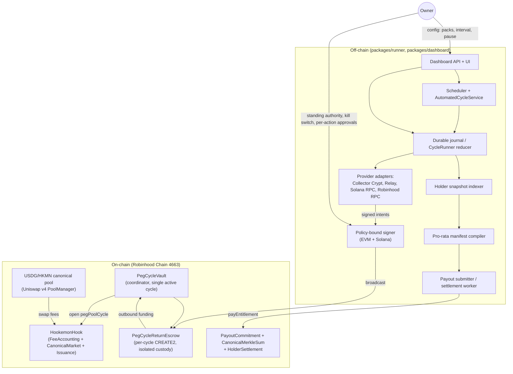

# HKMN Autonomous Peg-Cycle System — Money-Safety-First Design

Author: design pass over commit 5b365c8 (main) plus branches codex/phase2-revision-57 (bb385ae), codex/complete-v4-hook (HEAD of `<complete-v4-hook-checkout>`), and the non-authoritative legacy branch codex/mainnet-cycle-canary, per the audit summaries in `scratchpad/w1/summaries/*.json`.

---

## 1. Summary of the target system (15 lines)

The owner wants a fully autonomous loop on Robinhood Chain (4663): every N minutes (default 20, dashboard-adjustable), a bot buys one Collector Crypt pack with the HKMN swap-fee "process budget," opens it, sells the card via Collector Crypt's standard buyback (not Bybit — Bybit's NFT marketplace closed 2025-04-08 and never handled Collector Crypt or Pokémon cards; the transcript almost certainly means "buyback"), bridges Circle USD proceeds from Solana back to Robinhood Chain as USDG via Relay, and pays HKMN holders pro rata — with a dashboard for pack selection, interval control, stuck-cycle recovery, and public status. The canonical USDG/HKMN pool takes an inclusive 3.00% fee split 0.10% Programmable + 0.40% treasury + 2.50% process (owner-approved, coded exactly this way in `FeeAccounting.sol`; the transcript's "0.5% separated" already matches 0.10+0.40).

Today the repository implements this as a manually-triggered, single-cycle, requirements-revision-56 system: `HookemonHook`/`CanonicalMarket`/`FeeAccounting` correctly enforce the 3% split and quadrant math, but omit the fee policy's mandatory cumulative-remainder and 1000-unit-minimum anti-split-swap guards. `PegCycleVault` moves process-budget USDG through a linear EMPTY→FUNDED→OUTBOUND→RETURNED→PAYOUT_COMMITTED lifecycle with an absorbing `FAILED` dead end and no recovery for a partial/degraded return. `PayoutCommitment`/`CanonicalMerkleSum`/`HolderSettlement` implement a real, Solidity-parity, pull-based Merkle-sum payout capped at 1024 leaves per payout, with no pro-rata computation and no chunking for larger holder sets. `packages/runner` is a durable, hash-chained, compare-and-swap journal/reducer that models the whole buy→open→buyback→return→distribute cycle, but every provider interaction is a fixture Ed25519-signed envelope; production Collector Crypt, Relay, and Solana RPC calls are unimplemented (`INTEGRATION_PENDING` throws). There is no scheduler, no dashboard, and per AGENTS.md/ADR-0018 none is authorized for Phase 1 — automation is explicitly Phase 2, requiring a fresh requirements revision and owner approval (REQ-dashboard-1 is permanently reserved, never reusable).

Two unmerged branches contain most of the missing Phase 2 machinery in different, non-overlapping and partly conflicting shapes: `codex/phase2-revision-57` adds per-cycle CREATE2 return escrows and a dependency-free local operator-control CLI (prepare/freeze/start/status/resume/reconcile/abandon-expired); `codex/complete-v4-hook` adds an `AutomatedCycleService` (exclusive lease, budget gate, 8-stage driver, policy-bound EVM/Solana signing wallets, fee-settlement observer) but its Solidity changes conflict with main's already-merged `HookemonHook.sol`. Neither branch, nor main, implements a live Collector Crypt/Relay/Solana integration, a scheduler, a dashboard, or pro-rata computation at scale; that combination exists only in the historical, non-authoritative `codex/mainnet-cycle-canary` branch (real API clients, one successful manual one-pack mainnet run, a 20-minute-default scheduler wired only to a simulator), which may inform technique but must be re-implemented clean-room per `product/SOURCE_BOUNDARY.md`. Programmable's launch profile for chain 4663 is verified live today as "planned"/"unavailable" — production launch there is not yet possible; only EVM L1 mainnet is launch-authorized on Programmable today.

---

## 2. Architecture

### 2.1 Components

### 2.2 Trust boundaries

The design keeps the 20 trust boundaries already catalogued in `architecture/trust-boundaries.md` (TB-01..TB-20) and adds none that weaken them. The load-bearing ones for autonomy:

- **TB-01 (owner-authorization-to-action)** and **TB-11 (journaled-intent-to-signature-and-broadcast)**: every external mutation still needs a domain-separated, single-use authorization keyed to cycle/action/digest/destination/amount/cap/attempt. Autonomy changes *who* produces that authorization (a policy-bound signer instead of a human clicking through a CLI) — it does not remove the requirement.
- **TB-08 (process-liability-to-vault-cycle)**: unchanged — Operations (the scheduler's trigger identity) never custodies funds; only the vault/escrow does.
- **TB-16 (vault-return-to-funded-root)**: unchanged — dual-builder, dual-publication Merkle-sum verification stays required for the payout compiler.
- **TB-19 (release-closure-to-live-action)**: fixture evidence and live evidence stay in physically distinct schemas (`hookemon.fixture-*` vs. a new `hookemon.live-*` family) so a fixture run can never be mistaken for a funded one.
- **TB-20 (phase-one-to-future-product)**: this whole design is Phase 2 and requires the requirements-revision-58 process described in §8 before any of it runs live.

### 2.3 Custody and authority model

Four distinct identities, none of which is ever the same key:

1. **Operations trigger** — the scheduler process's own hot identity. Calls `openPegCycle`/`executeOutbound`-adjacent functions but is contractually forbidden from ever equaling `cycleVaultAccount` or `policyAccount` (already enforced today by `packages/runner/src/cycle/bindings.mjs:validateCycleCustody`, carried forward unchanged). It only *triggers*; it never holds principal.
2. **Vault authorizer** — the identity that calls `authorizeFunding`/`authorizePayout` on `PegCycleVault`. In production this must be a policy-constrained signer (§6), not an EOA a human types commands into, but it stays logically separate from Operations.
3. **Policy-bound execution signer(s)** — one EVM signer and one Solana signer, each schema-bound (`allowedDestinations`/`allowedFunctions`/`allowedAssets`/`maxAmount`) per `packages/runner/src/automation/policy-wallets.mjs` (branch `codex/complete-v4-hook`, 214 lines, tested in `packages/runner/test/automation/policy-wallets.test.mjs`). These sign and broadcast the outbound (buy pack) and return (bridge back) legs. They never receive raw key material in their config (verified by that file's own test asserting `privateKey`/`secretKey`/`mnemonic`/`seed`/`keypair` fields throw).
4. **Owner standing-authority key** — a distinct, higher-privilege key that only appears in: (a) the one-time ADR-0021 owner approval granting the automation standing authority (§8), (b) periodic re-approval of spend caps, and (c) the manual, cryptographic "kick a stuck cycle" `supersedeUnobservedIntent` path (`packages/runner/src/cycle/cycle-runner.mjs`, branch `codex/complete-v4-hook`), which is deliberately heavy — it requires dual independently-signed "not observed" proofs plus a fresh owner-signed authorization, and stays that way: a stuck cycle is rare enough that a 2-of-2 manual unstick is the right cost/safety trade-off, not a dashboard button.

No key in this list is ever also the Programmable-fee-liability claim key (`0x4957f49620AFf3Adbbe8195a4f633E49cc93376c`, immutable per `programmable-fee-policy.md`) — that claim path stays fully separate and is never automated (§3, GAP-4).

### 2.4 Data flow for one cycle (numbered, with signer)

1. **Trigger.** Scheduler's interval timer fires (Operations trigger identity, no signature needed — it is a read/decide step). It calls `decideCycleBudget()` (`packages/runner/src/automation/budget-gate.mjs`, already implemented and tested) against a live read of the hook's process liability. If `ready:false`, it stops here and reschedules.
2. **Funding authorization.** Vault authorizer signer produces a `FundingAuthorization` (per-cycle CREATE2 escrow target, exact amount, expiry, nonce) and submits `PegCycleVault.authorizeFunding`. This is a policy-bound signature, not a human action, but it is schema-identical to today's manual `authorizeFunding` call.
3. **Funding.** Operations trigger calls `ProcessBudget.openPegCycle(cycleId)`; the hook debits process liability and transfers exactly the authorized amount to the per-cycle `PegCycleReturnEscrow` (CREATE2-deterministic, `codex/phase2-revision-57`'s `PegCycleReturnEscrow.sol`, 72 lines, only 2 gated exact-transfer functions). No human signs this step; it is a contract call from the trigger identity moving zero discretionary value (the amount was already fixed in step 2).
4. **Outbound bridge.** EVM policy-wallet signer signs+broadcasts a Relay quote-execution (USDG→Solana Circle USD) sourced from the escrow via `executeOutbound`; `PegCycleReturnEscrow.sendOutbound` moves exactly the authorized amount to the immutable route executor, verified by exact balance delta both sides.
5. **Pack purchase.** Solana policy-wallet signer signs+broadcasts Collector Crypt's `generatePack` transaction (Circle USD → pack), instruction-allowlisted (memo + one `TransferChecked`, compute-budget capped) per the schema already proven in the legacy branch's `SolanaCollectorTransactionPolicy` (reimplemented clean-room, §4/§6).
6. **Open.** Solana policy-wallet signer signs+broadcasts `openPack`; the runner records the finalized on-chain custody delta (pack debited, NFT credited) exactly as `packages/runner/src/cycle/collector.mjs`'s fixture verifier already checks structurally.
7. **Buyback.** A *separate*, post-open owner (or standing-authority-delegated) authorization is required before the buyback signature — the drawn card is unknown in advance, so this cannot be pre-authorized (already modeled by `authorization.mjs`'s distinct post-open-buyback domain). Solana signer signs+broadcasts `buyback`; Circle USD credited to the policy wallet.
8. **Return bridge.** EVM/Solana policy-wallet signers execute the Solana→Robinhood Relay quote, Circle USD→USDG, into the per-cycle escrow's return address.
9. **Payout authorization.** Vault authorizer signs `PayoutAuthorization` (rootHash/rootSum from step 11 below must already exist — see note) and calls `authorizePayout`; requires the escrow's exact live balance to equal `rootSum` and to be `>= minimumReturnUsdg`.
10. **Payout funding.** Operations trigger calls `consumePayoutAuthorization`; escrow sends the exact `rootSum` to the hook, which credits one payout liability keyed by `payoutId`.
11. **Distribution compile (runs in parallel with 4-10, gated on step 8's finalized return amount).** The manifest compiler (new, §4) reads a finalized holder snapshot, computes pro-rata shares, builds the depth-10 Merkle-sum tree(s) (chunked if >1024 holders, §7), and produces two independently-reconstructed copies plus a distribution-verifier signature — unchanged from today's `packages/runner/src/distribution/manifest.mjs` design, just fed by a live snapshot instead of a fixture.
12. **Settlement.** The settlement worker (new, §4) calls `HolderSettlement.payEntitlement` once per leaf, permissionlessly (any caller may pay any valid proof — this step needs no privileged signature at all, only gas).

### 2.5 Recovery model

| Situation | Mechanism | Status |
|---|---|---|
| Broadcast succeeded but never observed (RPC dropped, node lag) | `CycleRunner.supersedeUnobservedIntent` — dual independent "not found, finalized" observer proofs + fresh owner-signed authorization replace the stalled intent | Exists (`codex/complete-v4-hook`), carry forward unchanged |
| Cycle frozen/planned but never started, plan expired | `abandon-expired` (operator CLI) | Exists (`codex/phase2-revision-57`), carry forward |
| Worker crashed mid-cycle | `resume` replays the durable journal and continues from the last committed stage | Exists, carry forward |
| Outbound/return leg failed cleanly, escrow balance is exactly 0 | `recordTerminalFailure` → `authorizeFundingAfterFailure` opens a fresh cycle with a fresh escrow; the failed escrow is permanently quarantined, contamination-isolated by CREATE2 | Exists (`codex/phase2-revision-57`), carry forward |
| Outbound/return leg failed **partially** — escrow holds a nonzero balance that is neither the full expected amount nor zero (bridge fee ate into the return, a partial Relay fill) | **No transition exists today.** `authorizePayout` requires balance==rootSum exactly; `recordTerminalFailure` requires balance==0 exactly. A cycle can get permanently stuck here. | **Gap — new work, WP-04, §3/§10** |
| A holder never claims their entitlement | Pull-based, non-expiring; no sweep needed (funds sit safely in the hook's solvent balance forever, no owner action required) | By design, acceptable |
| Programmable/treasury claim path drained by a compromised process-budget path | Solvency check (`_requireSolvent`) is global across all four liability buckets, so a fully-funded Programmable claim can still revert if process/payout liabilities have drained the shared balance | Known tension, documented (skill-and-prs GAP discussion); mitigated but not eliminated by keeping the process budget's per-cycle spend cap conservative relative to hook balance |

### 2.6 Kill switch

Two layers, matching the "policy-only vs. runtime-enforced" distinction the control-plane audit flags as currently missing (`external-action-stop.json`'s 11 booleans are explicitly non-runtime today):

1. **Off-chain, immediate:** a `paused` boolean in the operator state file (extends `packages/runner/src/operator/state-file.mjs`'s existing schema). The scheduler checks it before starting *any* new cycle-triggering call; an in-flight cycle finishes its current stage (never a hard-kill mid-transfer) and then halts. This is the dashboard's pause button.
2. **On-chain, structural:** the vault authorizer and policy-wallet signer keys are the actual capability to move money — revoking or rotating them (two-step handover, already implemented in `MoneyRoles.sol`) is the real kill switch. The owner's standing-authority ADR (§8) must specify that the owner can revoke this authority unilaterally and immediately, and that revocation is checked by the signer service on every signing request (not cached).

Neither layer is claimed to be a "true" emergency stop on an in-flight blockchain transaction — nothing can recall a broadcast Solana transaction. The design's actual safety property is: caps are small (§6 recommends starting at the legacy canary's proven $25–100 one-pack scale), every step is schema-bound before signing, and a paused scheduler plus revoked signer authority stops the *next* cycle from starting, which is the honest ceiling of what a kill switch can do here.

---

## 3. Contract changes before deployment (file by file)

All of these are on `packages/contracts/src/`. Each needs a requirements-revision-58 REQ change (see §8) before implementation, per AGENTS.md R2 (spec sync).

### 3.1 `accounting/FeeAccounting.sol` — close GAP-1 and GAP-2 (HIGH, money-safety)

Today `_splitLiability` (line 152) floors each of the 3 buckets independently **per swap** with no persisted remainder, and `CanonicalMarket._fee()` (`market/CanonicalMarket.sol:272`) has no lower bound — both confirmed by grep across the whole `src/` tree finding zero "remainder"/"1000"/"MINIMUM_GROSS" hits related to fee rounding (`skill-and-prs.json` GAP-1/GAP-2). This is a direct violation of the mandatory `programmable-fee-policy.md` v1.1.0 ("Policy 1.1.0 requires independent cumulative platform and project remainders for the lifetime of the canonical pool… A positive gross quote amount below 1,000 smallest quote-asset units must revert atomically"). For an unattended bot firing swaps continuously, this is exactly the split-swap bypass the policy exists to close — anyone (not just the automation) can grief the Programmable owner's entitlement by trading in sub-1000-unit slices forever.

Change: add two persisted `uint256` cumulative-remainder accumulators (Programmable, project/treasury+process combined or tracked per-bucket — match the kernel doc's `standard-fee-kernel.md:71-84` formula `Programmable_n = floor(sum(G_i * 1000)/1e6)` exactly), and a `revert` in `_fee()`/`_splitLiability` for `executedUsdg < 1000`. This changes accrual math (existing `test_revision55RoundingAssignsEveryRemainderToProcess`/`testFuzz_revision55SplitConservesTotal` in `FeeAccounting.t.sol` will need updating — they currently assert the *opposite*, per-swap-floor behavior by name). Spec consequence: this is a behavior change to `REQ-fee-accounting-1`, needs a new `REQ-fee-accounting-6` (cumulative remainder) and `REQ-fee-accounting-7` (minimum-quote revert), and a superseding ADR note against ADR-0016 (exact fee rounding), which currently documents the per-swap-floor-to-process design as the owner-approved Phase 1 choice.

### 3.2 `accounting/FeeAccounting.sol` / `HookemonHook.sol` — pin the Programmable owner (GAP-4, MEDIUM)

`fixedProgrammableBeneficiary` (`FeeAccounting.sol:13,37-42`) and `HookemonHook.ConstructorConfig.programmable` (`HookemonHook.sol:24,56`) are free constructor parameters, rejected only if zero or self. Nothing anywhere in `packages/contracts` asserts the deployed value equals the policy-mandated `0x4957f49620AFf3Adbbe8195a4f633E49cc93376c` — confirmed by repo-wide grep finding that address nowhere in the codebase. `bindings/robinhood-chain.json`'s own `productionReadiness.blockers` independently names this exact gap (`PROGRAMMABLE_OWNER_AND_CLAIM_DESTINATION_POLICY_RESOLUTION`).

Change: add a compile-time constant in `RobinhoodBindings.sol` (or a constructor-time `require`) pinning `programmableBeneficiary == 0x4957f49620AFf3Adbbe8195a4f633E49cc93376c`, so a misconfigured deployment cannot silently redirect the Programmable entitlement. Also add `ProgrammableClaimed`/`TreasuryClaimed` events (`FeeAccounting._claimLiability` currently has no `emit`) so the dashboard's status page and any future reconciliation tooling can index claims without polling. Spec: new `REQ-fee-accounting-8`.

### 3.3 `market/CanonicalMarket.sol` — relax the single-router / mandatory-hookData binding (HIGH, but a genuine trade-off — see §11 decision D2)

Today every swap must be routed through the one immutable `swapRouter` and carry an exact 128-byte hookData payload (`CanonicalSwapHookData`, domain `HOOKEMON_CANONICAL_SWAP_R54_A3_V1`) whose `sender` field must equal both the router-call's `sender` and that same immutable router address (`CanonicalMarket.sol` invariants, confirmed in `contracts-kernel.json`). This means the standard Uniswap Trading API, any wallet's default swap flow, and any DEX aggregator all revert against this pool — the community cannot buy HKMN through normal tooling, only through whatever custom script knows the router binding and hookData layout (confirmed independently: the vendored `swap-integration` skill has no concept of hookData at all and would generate a script that reverts against this pool, per `skill-and-prs.json` focus1).

Recommended change: fee accrual does not need hookData at all — `_accrueAuthenticatedSwap` derives `executedUsdg` from the actual pool delta, not from hookData. Make hookData **optional**: when absent or malformed, skip the `buyerHkmnCredit` bookkeeping (an auxiliary, non-safety-critical analytics field with no downstream consumer found in `ProcessBudget`/`PayoutCommitment`) but still collect the fee and accrue liabilities normally for *any* caller/router. Keep the automation's own swaps flowing through the current strict-hookData path (needed for the automation's own attribution and testing), but stop requiring it as a global precondition for the pool to function. This directly serves the money-safety-first goal: it removes the "protocol only works if you know a secret handshake" fragility without touching accounting logic. Spec consequence: revises `REQ-canonical-market-1..2`; needs owner sign-off since it changes an audited, tested invariant (`_matches`/hookData checks in `CanonicalMarketCallbackSurface.t.sol` cover this exact behavior and would need new test cases for the "no hookData" path). Full-fill-only enforcement (`InvalidFinalizedSwap` on partial fill) is left unchanged — that is a separate, lower-risk design choice not worth touching in this pass.

### 3.4 `process/PegCycleVault.sol` — degraded-return recovery (HIGH, closes the real "stuck forever" case)

Confirmed dead end: `authorizePayout` requires live balance `== rootSum` exactly (and `>= minimumReturnUsdg`); `recordTerminalFailure` requires live balance `== 0` exactly (`PegCycleVault.sol`, both main and the `codex/phase2-revision-57` per-cycle-escrow variant — the recovery branch adds failure-successor cycles but does not add a third outcome for a nonzero-but-wrong-amount return). Any bridge-fee shortfall, partial Relay fill, or a return that lands slightly under `minimumReturnUsdg` leaves the cycle permanently wedged in `OUTBOUND`/`FUNDED`-equivalent state with no on-chain path forward — exactly the case the owner's "restart/kick stuck cycles" dashboard requirement needs to cover, and today there is no contract function to call for it.

Change: add `recordDegradedReturn(cycleId, receiptDigest)` — authorizer-only, callable from `OUTBOUND` when balance is nonzero but does not satisfy `authorizePayout`'s exact/minimum conditions. It moves the escrow to a new terminal `DEGRADED` state that (a) permanently quarantines the balance (same CREATE2-isolation property `FAILED` already has, so it can never contaminate the next cycle), and (b) allows a fresh `authorizeFundingAfterFailure`-equivalent successor cycle to start, exactly mirroring the existing `FAILED`→successor flow. The quarantined degraded escrow's balance is *not* automatically swept anywhere (no owner should get a "free" mechanism to redirect stuck user-adjacent funds) — it becomes a distinct owner-approved manual recovery item, tracked and surfaced by the dashboard as "degraded, needs owner decision," not silently drained. Spec: new `REQ-process-budget-6`, and this directly supersedes the exact-zero clause of ADR-0019's failure handling (new ADR, §8).

### 3.5 `payout/PayoutCommitment.sol` + `payout/CanonicalMerkleSum.sol` + `settlement/HolderSettlement.sol` — chunked payouts beyond 1024 holders (MEDIUM, needed before the community can realistically outgrow one payout)

`TREE_WIDTH` is a hard 1024-leaf ceiling (`CanonicalMerkleSum.sol`); a single `payoutId`/manifest cannot represent more holders, and nothing in the repo chunks a cycle's proceeds across multiple payoutIds. Confirmed unimplemented across both `packages/contracts` and `packages/runner/src/distribution` (grep-verified).

Change: `PayoutCommitment.fundPayoutFromPegCycle` already credits one `payoutLiability[payoutId]` for the vault's exact returned amount. Add a **parent/child** structure: the funded amount stays keyed by the cycle's single `payoutId` as today (no change to the money-in-custody step, which is the safety-critical part), but allow **N independent chunk commitments** under that same `payoutId` (`commitPayoutChunk(payoutId, chunkIndex, rootHash, rootSum)`), each an independent depth-10 Merkle-sum tree, with a contract-enforced invariant that `sum(chunk.rootSum for all committed chunks) == payoutLiability[payoutId]` exactly before any chunk becomes claimable, and that the full set of chunks is declared atomically (an explicit "manifest closed" flag) so a partial/abandoned commitment can never leave some holders permanently unpayable. `HolderSettlement.payEntitlement` gains a `chunkIndex` parameter; `paidEntitlements` keys on `(payoutId, chunkIndex, index)`. This is the highest-risk contract change in this design (new state, new invariants) — recommend building and testing it, but shipping it *inactive* (chunk count fixed at 1 initially) until HKMN's real holder count approaches 1024, deferring the go-live decision to the owner. Spec: new `REQ-payout-commitment-7/8`, architecture revision bump (this changes `architecture/interfaces.json`'s payout-commitment module interface).

### 3.6 No change needed (confirmed correct, cite for the record)

- Zero LP fee + live per-swap protocol-fee revert (`CanonicalMarket._matches`): correct, re-checked every swap via `StateLibrary.getSlot0`. Keep.
- Quadrant-dependent return-delta declaration (before-when-specified/after-when-unspecified): verified line-by-line against `v4-core/Hooks.sol`'s sign convention in `skill-and-prs.json`; correct. Keep.
- Gross-basis-before-fee-deduction: correct. Keep.
- CREATE2 address self-check against the mined permission mask: correct, matches `compatibility-standard.md`. Keep.
- `_transferUsdg`/`_transferExactUsdg` exact-32-byte-bool + balance-delta checks: correct, fail-closed against non-standard ERC20 behavior. Keep (do **not** adopt `codex/complete-v4-hook`'s looser empty-return-accepted variant — that branch's `HookemonHook.sol` is strictly less defensive and must not be merged as-is, see §6).

---

## 4. Off-chain services (file by file)

All new code under `packages/runner/src/` (extends the existing zero-npm-dependency journal/reducer core) and a new `packages/adapters/` (the one place real npm dependencies are allowed, see §6) plus `packages/dashboard/`.

### 4.1 Scheduler (`packages/runner/src/scheduler/scheduler.mjs`, new, ~250 lines)

A dependency-free interval loop (`setInterval`/`unref`'d, matching the legacy branch's `HookemonScheduler` shape but reimplemented clean-room) that: reads `intervalMs` from the operator state file (dashboard-editable, default 1,200,000 = 20 min), checks the pause flag (§2.6), acquires the exclusive lease (`packages/runner/src/automation/exclusive-lease.mjs`, existing, tested), and calls `AutomatedCycleService.runOnce()` or `.recoverActiveCycle()`. On any uncaught stage error it logs, releases the lease, and reschedules — it never silently swallows a stuck cycle; it surfaces stage/status to the observability layer (§4.9) every tick.

### 4.2 Cycle worker (`packages/runner/src/automation/automated-cycle-service.mjs`, port from `codex/complete-v4-hook`, ~200 lines of adaptation)

The existing 189-line `AutomatedCycleService` (lease + budget-gate + 8-stage driver, dependency-injected `leaseStore`/`budgetReader`/`cycleRepository`/`runnerFactory`/`stageDriver`/`feeSettlementObserver`) is kept largely as-is — it is 100% dependency-injected and never references Solidity ABIs or RPC URLs directly, so it does not conflict with any contract change. Rewire its stage list to the escrow-based funding model from `codex/phase2-revision-57` (funding target is the per-cycle `PegCycleReturnEscrow`, not the vault itself) and its terminal-observation hook to the new production reader (§4.10).

### 4.3 Provider adapter: Collector Crypt (`packages/adapters/src/collector-crypt.mjs`, new, ~400 lines)

Clean-room implementation of `GET /api/machines`, `POST /api/generatePack`, `POST /api/openPack`, `GET /api/buyback/available`, `POST /api/buyback`, `POST /api/submitTransaction`, `GET /api/pack/status` against `https://gacha.collectorcrypt.com`, `x-api-key` header, exponential-backoff retry, idempotency via the runner's existing `requestDigest` pattern. Verified live today: `pokemon_25` pack, $25, 85% instant buyback, still listed unchanged. Note the still-open `CONFUSION-COLLECTOR-AUTH-001`: GET `/api/status`/`/api/machines` work with no key despite documented requirement — treat the documented requirement as authoritative for all calls (always send the key) rather than relying on the observed unauthenticated behavior, which could change without notice.

### 4.4 Provider adapter: Relay bridge (`packages/adapters/src/relay-client.mjs`, new, ~300 lines)

`POST /quote/v2`, `GET /intents/status/v3` against `https://api.relay.link`, for both legs: Robinhood USDG (chain 4663) → Solana Circle USD (chain 792703809) outbound, and the reverse for return. Verified live today that both currencies are `depositEnabled` on both chains. No quote has ever been executed by this repo (an intentional, correctly-honored ask-first boundary during the audit) — this adapter's first real quote is itself an ask-first action for the owner to approve before the dry-run graduates to live (§9/§12).

### 4.5 Provider adapter: Robinhood/Solana RPC + contract calls (`packages/adapters/src/robinhood-rpc.mjs`, `packages/adapters/src/solana-rpc.mjs`, `packages/adapters/src/hook-contract-client.mjs`, new, ~600 lines combined)

Thin, viem-based (EVM) and raw-JSON-RPC (Solana) read/write wrappers: contract calls for `openPegCycle`/`authorizeFunding`/`executeOutbound`/`authorizePayout`/`consumePayoutAuthorization`/`recordDegradedReturn`, balance reads, finalized-block transaction/receipt fetches. This is the one place a real dependency (`viem`) is justified — see §6.

### 4.6 Holder snapshot indexer (`packages/runner/src/distribution/snapshot-indexer.mjs`, new, ~350 lines, dependency-free — reads via the adapter, computes independently)

Reads HKMN `Transfer` logs from Robinhood RPC up to a fixed finalized block, folds them into current balances (not `eth_call` balance reads, which are not reproducible/auditable the same way — a log-derived snapshot can be independently re-verified by a second builder from the same finalized block, satisfying TB-16's dual-builder requirement). Excludes a fixed, documented address set: the canonical pool, the hook itself, the vault, every per-cycle escrow (computed via the same CREATE2 formula the contracts use), and the treasury. Produces the `hookemon.hkmn-holder-snapshot.v1` schema (finalized block number/hash, per-holder balance, total supply, exclusion list with justification) that today's `reconcile.mjs`/`manifest.mjs` already consume structurally (their `validateSnapshot` only checks shape, per `runner-distribution.json`) — this component is what actually produces a *real*, authenticated snapshot instead of a caller-supplied fixture.

### 4.7 Pro-rata manifest compiler (`packages/runner/src/distribution/pro-rata.mjs`, new, ~250 lines)

The one genuinely missing computation: given a finalized snapshot and a cycle's returned USDG amount, computes `amount_i = floor(balance_i * proceeds / totalEligibleSupply)` per holder, tracks the floor-rounding dust (`proceeds - sum(amount_i)`), and **carries that dust forward** into the next cycle's distributable pool (added to that cycle's proceeds before the next split) rather than sending it to the project or leaving it stranded. Chunks holders into ≤1024-entry groups (deterministic, sorted by address) if the snapshot exceeds 1024 non-zero balances, feeding §3.5's chunk-commitment contract path. Its output feeds directly into the existing, unmodified `reconcile.mjs`/`manifest.mjs` verification pipeline (`deriveHolderDistributionCandidate`), so all of today's exact-sum, closed-shape, no-getter-side-channel invariants apply unchanged.

### 4.8 Payout submitter / settlement worker (`packages/runner/src/distribution/settlement-worker.mjs`, new, ~300 lines)

After a distribution is verified and funded (existing pipeline), calls `HolderSettlement.payEntitlement` once per leaf (per chunk if chunked), with retry/backoff, tracking `paid`/`unpaid` per leaf in the durable journal so a crash mid-distribution resumes exactly where it left off (idempotent — `payEntitlement` itself reverts `EntitlementAlreadyPaid` on a retry, so double-submission is safe by construction, not just by the worker's own bookkeeping).

### 4.9 Configuration & secrets (`packages/runner/src/config/`, new, ~150 lines + a documented secrets contract)

All spend caps, allowlists, and intervals live in the dashboard-editable, versioned, atomically-written operator state file (already exists, `packages/runner/src/operator/state-file.mjs`). Secrets (signer credentials) never enter that file or the git repo; the signer service (§6) resolves them from an OS keychain (macOS Keychain pattern reimplemented clean-room) or a remote policy-wallet provider's own credential store, referenced only by an opaque handle in config.

### 4.10 Observability (`packages/runner/src/observability/`, new, ~200 lines)

Structured JSON logging per stage transition (no dependency — `console.error`/`console.log` with a fixed schema), a `cycle-status` projection consumed by the dashboard, and a minimal alert hook (webhook POST on `DEGRADED`/`FAILED`/lease-contention) — intentionally not a full alerting stack; `ops/HANDOFF.md` already documents "no alert channel has ever been test-fired," and this design closes that gap with the simplest thing that actually pages someone, deferring a richer system to a later task.

---

## 5. Dashboard

**Audience:** the owner (full control) and the public (read-only status — the owner explicitly wants "community-facing status"). No third party gets write access; there is exactly one operator.

**Auth:** owner-authenticated endpoints use a timing-safe-compared bearer credential (the legacy branch's `operator-access-auth.js` pattern — Cloudflare-Access-style JWKS or a proxy credential — reimplemented clean-room; either is acceptable, recommend the simpler proxy-credential form for a single-operator system). Public endpoints are unauthenticated, read-only, and never leak signer identities, exact holder balances, or in-flight authorization digests before they are safe to disclose.

**API (dependency-free `node:http`):**

| Method & path | Auth | Payload |
|---|---|---|
| `GET /healthz` | public | — |
| `GET /public/api/status` | public | current cycle stage, next scheduled run ETA, last N cycles' outcomes (no amounts pending, no digests) |
| `GET /public/api/community-dashboard` | public | fee split, cumulative distributed-to-holders total, holder count, contract addresses, links to on-chain evidence |
| `GET /api/config` | owner | `{ intervalMinutes, packCodes[], paused, spendCapUsdg }` |
| `PUT /api/config` | owner | partial update, schema-validated against the operator-state config shape |
| `GET /api/packs` | owner | cached Collector Crypt catalog (via §4.3's adapter, 120s TTL, matches the legacy branch's caching pattern) |
| `POST /api/cycle/pause` \| `/resume` | owner | — |
| `POST /api/cycle/reconcile` | owner | evidence payload, forwarded to `OperatorControl.reconcile` |
| `POST /api/cycle/abandon-expired` | owner | — |
| `GET /api/cycle/:id` | owner | full journal/status for one cycle |
| `GET /api/cycles` | owner | paginated cycle history |

Note: `POST /api/cycle/supersede` (the "kick a stuck cycle" cryptographic unstick) is deliberately **not** a dashboard button — it requires the owner's out-of-band Ed25519 signature over dual-observer proof (§2.5) and stays a manual, high-friction operation reachable only via a documented CLI command, not a web click, exactly matching the safety posture `codex/phase2-revision-57`'s own design doc already argues for (rejecting a dashboard-driven unstick as an explicit alternative).

**Pages:** owner console (config form, cycle list/detail, pack picker, pause/resume, health); public status page (cycle stage, next-run countdown, cumulative distribution stat, contract-address links).

**Storage:** the durable, money-critical journal stays the existing hash-chained append-only file store (never SQLite — its CAS/replay guarantees are what make crash recovery safe). Dashboard-only concerns (cycle-history pagination, cached pack catalog) may use `node:sqlite` (already a control-plane dependency, zero new install) as a read-optimized projection rebuilt from the journal, never as a second source of truth for money state.

---

## 6. Dependency and signer decision

**Dependencies — hybrid, isolated by package boundary.** Recommend: keep `packages/contracts` and the existing `packages/runner/src/{cycle,distribution,operator}` deterministic core exactly as they are today — zero npm dependencies, Node builtins only, hash-pinned, auditable byte-for-byte (this is a real security asset the audit repeatedly confirms: hand-rolled Keccak/Ed25519-verify code with no supply-chain surface). Put all *new* dependencies (`viem` for EVM calls/ABI encoding, `@solana/web3.js` for Solana RPC/transaction construction) exclusively in the new `packages/adapters/` package, which the deterministic core only ever talks to through a narrow, already-proven dependency-injection seam (`stageDriver`/`runnerFactory` in `AutomatedCycleService`, `signerClient`/`observerClient` in the policy-wallet classes) — so `packages/runner`'s own tests keep running with zero installs, and a compromised or vulnerable transitive dependency in `viem`/`@solana/web3.js` cannot reach the money-accounting logic without going through the same authorization checks every other caller does. This requires the 3-way coordinated change the control-plane audit flags (workflow file, `product/dependency-pins.json`, `scripts/verify-control-dependencies.mjs`) — scope it as its own task (WP-15) rather than bundling it into feature work.

Rejected alternative: fully dependency-free hand-rolled EVM/Solana primitives everywhere (the legacy branch partly attempted this for Solana RPC). Reason for rejection: correctly implementing transaction signing/serialization and RPC edge cases (fee bumping, nonce management, finality polling) by hand is exactly the kind of code where a subtle bug directly costs the owner money; `viem`/`@solana/web3.js` are the audited, widely-used standard for this, and isolating them to the adapter boundary captures the supply-chain benefit of the zero-dep core without paying the correctness cost of reinventing chain clients.

**Signer — policy-bound, remote/keychain-backed, never a raw key in application config.** Recommend the `codex/complete-v4-hook` `EvmPolicyWallet`/`SolanaPolicyWallet` pattern (schema-bound intents, dependency-injected `signerClient`) backed in production by *either* (a) a remote custodial policy-wallet provider (the legacy branch used Privy; any equivalent HSM-backed policy-signing service is acceptable, reimplemented clean-room against that provider's own current API — never copy the legacy branch's Privy wiring verbatim) or (b) the OS-keychain-backed local signer (`macos-keychain.js`/`macos-signers.js` pattern, clean-room) for an initial bring-up phase, with a hard requirement that whichever is chosen enforces the policy schema (`allowedDestinations`/`Functions`/`Assets`/`maxAmount`) itself, not merely trusts the caller to have checked it first. Reject the legacy branch's MetaMask-mobile-QR-scan signer entirely — it requires a human to physically approve every transaction, which is structurally incompatible with unattended operation. Recommend starting with the OS-keychain option (lower operational complexity to stand up, matches the one successful historical mainnet canary's actual signing path) and migrating to a remote policy-wallet provider once cycle volume justifies the added infrastructure.

---

## 7. Launch path via Programmable on 4663

**Verified today (2026-09-02):** Programmable's discovery document now lists chain 4663 ("Robinhood Chain Mainnet") with `status: "planned"`; the v4 capabilities endpoint returns `readiness.status: "unavailable"`, `reasonCodes: ["ROBINHOOD_CHAIN_PROFILE_UNAVAILABLE"]`, `chainDeployment: null`, `profile: null`. Only chain 1 (EVM L1) has `productionLaunchAuthorized: true` on profile `programmable.direct-native-hook-graph.v1` today. **Production launch on 4663 is not possible today** — this is an external dependency with no committed ETA, outside the repo's control.

**Can be prepared now (dry-run, no execution):**
- A `submission.json` per the builder skill's schema, with every provider-bound field populated where knowable (fee split, hook permission mask, hookData layout if §3.3's relaxation ships, the pinned Programmable owner address from §3.2) and explicitly `null`/`INTEGRATION_PENDING` for anything still unavailable (deployment addresses, chain-deployment digest).
- A full launch plan artifact mirroring `script/release/PhaseOneReleasePlan.sol`'s existing pattern: named identities, CREATE2 triples for the vault and hook, expected runtime codehashes — extended to also cover the new escrow and (if built) chunked-payout contracts.
- A **custom** `LiquidityLauncher` strategy design (the stock `InstantLaunchStrategy` is confirmed hookless/native-ETH/fixed-1e9-supply and unusable for this design — verified against the Uniswap SDK's own deployment guide) — write the strategy contract and its tests now; it cannot be deployed until the Robinhood LiquidityLauncher profile itself is launch-ready, but nothing blocks writing and testing it against a fork today.
- CREATE2 hook-address mining (script only, no deployment) against the finalized permission mask, once §3.3's hookData relaxation (if adopted) is finalized — mining before that would need re-mining if the mask changes, so sequence this after §3.3 is decided, not before.

**Waits for external readiness:** the actual `chainDeployment`/`profile` binding, any real submission/registration call to Programmable, and — separately — resolving the Universal Router address discrepancy (repo-pinned `0x06afBA43fd06227fA663b0dAeCF536F6eaA6BF99` with an on-chain-verified runtime hash vs. Uniswap's current public deployments page listing `0x8876789976decbfcbbbe364623c63652db8c0904` for chain 4663) via a fresh finalized-RPC probe before any swap-routing code trusts either value.

---

## 8. Process artifacts

**Requirements revision 58 outline** (new REQ ids, additive to the frozen revision-56/-57 set; supersedes nothing from Phase 1's immutable hook guarantees):

- `REQ-fee-accounting-6`: cumulative Programmable/project fee remainders persist across swaps for the pool's lifetime; a claim never resets them.
- `REQ-fee-accounting-7`: a swap with gross executed-USDG below 1,000 smallest units reverts atomically.
- `REQ-fee-accounting-8`: the Programmable beneficiary is compile-time pinned to the policy owner address; claim events are emitted.
- `REQ-canonical-market-6`: the canonical pool accepts swaps from any caller/router; hookData is optional and, when present and valid, credits `buyerHkmnCredit`.
- `REQ-process-budget-6`: a return that is neither exact-match-or-above-minimum nor zero moves the cycle to a terminal, quarantined `DEGRADED` state and permits a fresh successor cycle.
- `REQ-payout-commitment-7`: a single cycle's payout liability may be committed as multiple independent chunk manifests, each a depth-10 Merkle-sum tree, whose root sums must exactly total the funded liability before any chunk is claimable.
- `REQ-cycle-control-2` (extends rev 57's `REQ-cycle-control-1`): a scheduler may trigger cycle stages autonomously within an owner-approved standing authority, subject to a per-cycle spend cap, a maximum cycles-per-day cap, and an immediately-effective pause/kill switch.
- `REQ-distribution-1`: a finalized on-chain Transfer-log snapshot is the sole source of holder balances for pro-rata computation; a documented exclusion list removes pool/hook/vault/escrow/treasury addresses.
- `REQ-dashboard-2` (a **new** id — REQ-dashboard-1 stays permanently reserved and unreusable per ADR-0018): a read-only public status surface and an owner-authenticated config/control surface, config-mutation only, no direct fund movement.

**ADR-0021 outline** ("Autonomous cycle authority"): supersedes ADR-0018's "no scheduler" clause and ADR-0019's exact-zero `recordTerminalFailure` clause, *specifically and only* for Phase 2 under a new owner-approved standing authority; states the four-identity custody model (§2.3), the two-layer kill switch (§2.6), and that every autonomous action stays schema-bound and journaled exactly as today's manual actions are — autonomy changes who signs, not what is checked.

**Owner-approval drafts needed (unsigned, for the owner to review and sign):** (1) revision-58 baseline approval; (2) standing signing-authority grant naming the exact per-cycle spend cap, max cycles/day, and kill-switch behavior; (3) Phase 2 delivery-boundary opening (flips `product/delivery-boundary.json`'s `phases.2` from `CLOSED` to `OPEN`, per `scripts/check-delivery-boundary.mjs`'s existing machinery); (4) approval of the §3.3 hookData-relaxation change specifically, since it alters an already-tested, owner-reviewed invariant.

**Delivery-boundary/CI changes:** open phase 2 in `product/delivery-boundary.json` (currently hardcoded `openDeliveryPhase: 1`); regenerate the 6 required registries with `deliveryPhase: 2` sidecars for every new record; add the new `packages/adapters` dependency footprint to `product/dependency-pins.json` and `.github/workflows/v4-gates.yml` (3-way coordinated, §6); relax `scripts/lib/ledger.mjs`'s task-deferral restriction (currently hardcoded to `P1-011` only) or mint fresh Phase-2-scoped task ids that don't need deferral at all (recommended — avoids touching that hardcoded gate).

**Task cards:** use a fresh `P2b-0xx` prefix (or renumber `codex/phase2-revision-57`'s `P2-001..012` as canonical and continue from `P2-013`) — both unmerged Phase-2 branches independently used `P2-001..004`/`P2-012` for unrelated work, so reusing bare `P2-0xx` numbers would collide; this needs an explicit owner/maintainer decision before task cards are written (§11, decision D1 covers which branch's numbering becomes canonical).

**Docs to update:** new `docs/modules/` cards for `peg-cycle-escrow.md` (promote from rev57's design doc), `automated-cycle-service.md`, `pro-rata-distribution.md`, `holder-snapshot-indexer.md`, `dashboard.md` (replace the current Phase-2-only sketch with the real design), `adapters.md`; update `docs/modules/index.json`'s digest registry for all of the above (and fix the pre-existing stale `cycle-runner.md` digest bug already found live on `codex/phase2-revision-57`, commit `228d4b1`, which currently fails `node --test scripts/tests/gates.test.mjs`'s architecture-A6 check).

---

## 9. Test and evidence strategy

- **Unit:** extend `FeeAccounting.t.sol`/`PegCycleVault.t.sol`/`CanonicalMerkleSum.t.sol`/`PayoutCommitment.t.sol` for every §3 change (cumulative remainder boundary cases, sub-1000-unit revert, no-hookData swap path, `DEGRADED` transition, chunk-commitment sum invariant). Extend `packages/adapters` with adapter-level unit tests using recorded fixture HTTP/RPC responses (never live calls in CI).
- **Fixture end-to-end:** extend the existing 25-test `packages/runner/test/cycle/*` + `test/distribution/*` suites to drive the new pro-rata compiler and chunked-payout path through the same fixture harness, keeping the current dual-copy/dual-signature Merkle verification intact.
- **Forked/anvil integration for the hook path:** extend `RobinhoodV4PoolManager.t.sol`'s pattern (already deploys a *real* `PoolManager`/`PositionManager` from the pinned Uniswap submodules) to a fork of live, finalized Robinhood Chain state (read-only RPC, no key needed) so the hook's swap path is tested against real deployed bytecode, not just a hand-written stand-in hook.
- **Dry-run mode against real read-only RPC/APIs:** a scheduled (owner-triggered, not autonomous — matches AGENTS.md's "at most one 60-minute-or-slower watchdog" rule) drift-check task that re-probes Collector Crypt's `/api/status`+`/api/machines`, Relay's `/chains`, Programmable's discovery/capabilities endpoints, and the Uniswap deployments page, comparing against the pinned `bindings/robinhood-chain.json` — this is exactly the check that would have caught the Universal Router address discrepancy and the Programmable "planned" status change days sooner than a human noticing.
- **Live canary gating:** strictly behind the ADR-0021 standing-authority approval (§8), never before it; start at the legacy branch's proven scale (one pack, ~$25–35 gross including bridge fees, equal-split fallback recipients before pro-rata is trusted end-to-end) exactly as its one successful historical run did, and only widen scope (interval, spend cap, holder count) after several observed clean cycles.

---

## 10. Ordered work packages

Risk classes follow `architecture/risk-classes.json`'s R1-R4 taxonomy (R3/R4 = money-moving or trust-boundary-critical, requires a fresh-context independent reviewer per AGENTS.md).

| # | Title | Goal | Deps | Write set | Read set | Tests | Acceptance | Risk | Parallel? |
|---|---|---|---|---|---|---|---|---|---|
| WP-01 | Fee cumulative remainder + minimum-quote revert | Close GAP-1/GAP-2 | none | `packages/contracts/src/accounting/FeeAccounting.sol`, `src/market/CanonicalMarket.sol`, their tests | `programmable-fee-policy.md`, `standard-fee-kernel.md` | `forge test --match-path 'test/accounting/*.t.sol' 'test/market/*.t.sol'` | Cumulative remainder never resets on claim; swap <1000 units reverts; existing 100k-fuzz conservation test still passes with new math | R4 | Yes, with WP-02 |
| WP-02 | Pin Programmable owner + claim events | Close GAP-4 partially | none | `src/bindings/RobinhoodBindings.sol`, `src/accounting/FeeAccounting.sol`, `src/HookemonHook.sol` | `programmable-fee-policy.md` | `forge test --match-path 'test/bindings/*.t.sol' 'test/accounting/*.t.sol'` | Deployment reverts if `programmable != 0x4957f...`; `ProgrammableClaimed`/`TreasuryClaimed` events emitted with exact amounts | R3 | Yes, with WP-01 |
| WP-03 | Optional hookData / open router access | Let normal wallets swap | none | `src/market/CanonicalMarket.sol`, `test/market/CanonicalMarketCallbackSurface.t.sol` | `compatibility-standard.md` | full market test suite + new no-hookData test cases | Swap from an arbitrary router with no hookData succeeds, fee accrues correctly, no `buyerHkmnCredit` given; existing hookData path unchanged | R4 | No — touches shared invariants WP-01/02 also test; sequence after |
| WP-04 | Degraded-return recovery state | Close the real stuck-forever gap | WP-06 (needs escrow base) | `src/process/PegCycleVault.sol` (or its rev57-merged successor), `src/process/IPegCycleVault.sol`, tests | ADR-0019 | `forge test --match-path 'test/process/*.t.sol'` incl. new degraded-path tests | Nonzero-below-minimum return moves to `DEGRADED`, quarantined, successor cycle can start; balance never auto-swept | R4 | No, sequential after WP-06 |
| WP-05 | Chunked payouts >1024 holders | Support holder growth | none | `src/payout/CanonicalMerkleSum.sol`, `src/payout/PayoutCommitment.sol`, `src/settlement/HolderSettlement.sol`, tests | TB-16, TB-17 | new Solidity tests: partial-chunk-set rejected, exact-sum-across-chunks enforced, per-chunk pull payment | Chunk set is atomic (all-or-nothing claimable), sum invariant holds, single-chunk mode behaves identically to today | R4 | Yes, independent of WP-01..04 |
| WP-06 | Merge rev57 onto main | Get per-cycle escrow + operator CLI onto the integrated base | none | resolve the 8 conflicting files (`docs/modules/index.json`, `docs/modules/peg-cycle-vault.md`, `gates/runs/init.json`, `PegCycleVault.sol`, `product/delivery-boundary.json`, receipts r-00430/431, `final-review.test.mjs`, `tasks.json`); fix the stale `cycle-runner.md` digest bug | both branches' full diffs | `node --test scripts/tests/*.test.mjs`, full runner+operator suite (142 tests) | Merge is git-clean, gates re-evaluate without the digest-mismatch failure, all 142 runner/operator tests pass | R3 | No — must land before WP-04/07/13/14 |
| WP-07 | Port automation modules from complete-v4-hook | Get lease/budget-gate/policy-wallets/fee-settlement onto the merged base | WP-06 | `packages/runner/src/automation/*` (ported, rewired to escrow model); explicitly drop that branch's conflicting `ProcessBudget.sol`/`HookemonHook.sol` changes; keep only the additive `SwapLiabilitiesAccrued` event | both branches' automation diffs | `packages/runner/test/automation/*`, `test/integration/automated-cycle.test.mjs` | All 26+ automation tests pass against the merged contracts; no duplicate on-chain function signatures | R3 | No, after WP-06 |
| WP-08 | Collector Crypt adapter | Real pack buy/open/buyback client | WP-06 | `packages/adapters/src/collector-crypt.mjs` + tests (fixture HTTP responses) | `docs.collectorcrypt.com/gacha/api`, legacy `collector-crypt.js`/`collector-executor.js` (technique only, clean-room) | adapter unit tests against recorded fixtures; live-read-only smoke test (`GET /api/status`, `/api/machines`) | Every documented mutation endpoint has a typed client function; x-api-key always sent; idempotent retry on network failure | R2 | Yes |
| WP-09 | Relay bridge adapter | Real USDG↔Circle USD bridge client | WP-06 | `packages/adapters/src/relay-client.mjs` + tests | `api.relay.link` docs, legacy `relay-client.js` (technique only) | adapter unit tests against recorded fixtures; live-read-only `/chains` smoke test | Quote/status typed client; both bridge directions covered; no live quote executed by tests | R2 | Yes |
| WP-10 | Robinhood/Solana RPC + contract-call adapters | Real chain I/O | WP-06, WP-15 (dependency plumbing) | `packages/adapters/src/{robinhood-rpc,solana-rpc,hook-contract-client}.mjs` + tests | verified live RPC facts (§external-facts) | unit tests against a local anvil fork + recorded Solana RPC fixtures | All contract calls used by §2.4's data flow have a typed adapter function with exact-parameter encoding tests | R3 | Partially parallel with WP-08/09 |
| WP-11 | Holder snapshot indexer | Real, authenticated holder balances | WP-06 | `packages/runner/src/distribution/snapshot-indexer.mjs` + tests | `reconcile.mjs`'s existing `validateSnapshot` schema | unit tests against a synthetic Transfer-log fixture; exclusion-list correctness test | Snapshot schema matches what `reconcile.mjs` already expects; excluded addresses (pool/hook/vault/every escrow/treasury) never appear as recipients | R3 | Yes, independent |
| WP-12 | Pro-rata manifest compiler | Compute real per-holder amounts | WP-11 | `packages/runner/src/distribution/pro-rata.mjs` + tests | existing `manifest.mjs`/`reconcile.mjs` (unmodified consumers) | unit tests: floor-rounding exactness, dust carryforward across two simulated cycles, >1024-holder chunking | Output feeds unmodified into `deriveHolderDistributionCandidate` and passes its exact-sum check; dust never lost or sent to project | R3 | No, after WP-11 |
| WP-13 | Payout submitter / settlement worker | Actually pay every holder leaf | WP-05, WP-10, WP-12 | `packages/runner/src/distribution/settlement-worker.mjs` + tests | `HolderSettlement.payEntitlement` ABI | integration test: crash-mid-distribution resume, double-submit safety | Every committed leaf/chunk gets paid exactly once; a crash resumes without double-payment attempts (or safely no-ops on retry) | R3 | No, after WP-05/10/12 |
| WP-14 | Scheduler + cycle-worker wiring | The actual 20-minute loop | WP-06, WP-07, WP-08, WP-09, WP-10 | `packages/runner/src/scheduler/scheduler.mjs`; wiring in `packages/runner/src/automation/automated-cycle-service.mjs` | operator state-file schema | integration test: pause blocks next cycle, resume continues an interrupted one, interval change takes effect on next tick | Full dry-run cycle (against real read-only probes + fixture-signed mutations) completes end to end | R4 | No, after WP-07..10 |
| WP-15 | Dependency + signer plumbing | Unblock WP-08..10 | none | `packages/adapters/package.json`, lockfile, `.github/workflows/v4-gates.yml`, `product/dependency-pins.json`, `scripts/verify-control-dependencies.mjs`; signer config schema in `packages/runner/src/config/` | control-plane audit's 3-way-coordination note | `node --test scripts/tests/control-dependencies.test.mjs` | CI installs and verifies the new dependency footprint by hash; signer config never contains raw key material (schema-enforced) | R2 | No — must land before WP-08/09/10 |
| WP-16 | Observability | Cycle status + alerting | WP-14 | `packages/runner/src/observability/*` | `ops/HANDOFF.md` | unit tests for status projection shape; one fired-alert integration test | Status projection reflects live journal state; a `DEGRADED`/`FAILED` transition fires a webhook | R2 | Yes, alongside WP-14 |
| WP-17 | Dashboard backend | API + storage | WP-14, WP-16 | `packages/dashboard/src/server.mjs`, API handlers, sqlite projections | §5 API table | endpoint tests for every route incl. auth-rejection cases | Every §5 endpoint implemented and tested; owner routes reject without credential; public routes never leak in-flight digests | R3 | No, after WP-14/16 |
| WP-18 | Dashboard frontend | Owner console + public status page | WP-17 | `packages/dashboard/src/public/*.html` (static, dependency-free) | §5 pages | manual/browser smoke test | Config form round-trips; public page renders without auth | R1 | Yes, alongside WP-17's later half |
| WP-19 | Programmable submission.json + launch plan | Prepared-not-executed launch artifacts | WP-06 | `release/phase2/submission.json`, launch-plan doc | builder skill's submission.json template | `node scripts/tests/phase2-launch-evidence.test.mjs`-style schema test (port from complete-v4-hook) | Schema validates in `INTEGRATION_PENDING` state; every knowable field populated, every unknowable field explicitly null | R2 | Yes |
| WP-20 | Custom LiquidityLauncher strategy + hook CREATE2 mining | Prepared launch mechanics | WP-03 (mask may change) | new `src/launch/CustomLaunchStrategy.sol` + tests; mining script | Uniswap liquidity-launcher SDK docs | forge tests against a fork of the vendored liquidity-launcher submodule | Strategy compiles and passes unit tests against a forked launcher; mined hook address matches the finalized permission mask | R3 | No, after WP-03 |
| WP-21 | Requirements revision 58 + ADR-0021 + owner-approval drafts + delivery-boundary open | Process artifacts | WP-01..05 (needs final REQ text) | `specs/requirements.json`, `decisions/ADR-0021-*.md`, `decisions/owner-approvals/*-revision-58-*.json` (drafts, unsigned), `product/delivery-boundary.json` | §8 outline | `node --test scripts/tests/reqs.test.mjs scripts/tests/delivery-boundary.test.mjs` | Revision 58 traces cleanly; delivery-boundary phase 2 opens without breaking phase 1's closed invariants | R2 | No, after contract WPs settle their exact behavior |
| WP-22 | docs/modules cards + index | Doc duty (R1) | WP-01..14 (describes finished modules) | `docs/modules/*.md`, `docs/modules/index.json` | R1 doc-duty format | `node --test scripts/tests/gates.test.mjs` (architecture A6) | Every new/changed module has a current, digest-matching card | R1 | Yes, trails other work |
| WP-23 | Forked/dry-run integration tests + scheduled drift-check | Evidence against real state | WP-06, WP-10 | new fork-test suite, a `scripts/check-binding-drift.mjs` read-only probe | verified live facts | run against a local anvil fork of finalized Robinhood state | Hook swap path passes against real deployed PoolManager/PositionManager bytecode; drift-check flags the known Universal Router / Programmable-status discrepancies | R2 | Yes |
| WP-24 | End-to-end fixture regression for chunking + degraded-return | Prove WP-04/05 against the full cycle | WP-04, WP-05, WP-06 | extend `packages/runner/test/integration/*` | existing fixture harness | `node --test packages/runner/test/**` | A simulated >1024-holder cycle and a simulated degraded-return cycle both complete through the existing fixture pipeline | R3 | No, after WP-04/05 |
| WP-25 | Red-team refresh at revision 58 | Re-run STRIDE against the new surfaces | WP-01..14, WP-21 | `qa/redteam/*.json`, `decisions/redteam/findings.json` | current STRIDE artifacts (still bound to revision 55, already stale) | red-team doubt-loop process per AGENTS.md | Fresh findings against the automation, escrow, chunked-payout, and open-router surfaces; carries forward or re-scopes RT-R55-02/05/06 | R4 | No, last |

---

## 11. Open owner decisions

**D1 — Which unmerged branch's task numbering becomes canonical for Phase 2?** (a) `codex/phase2-revision-57`'s `P2-001..012` stays canonical, complete-v4-hook's automation work gets renumbered starting `P2-013`. (b) Fresh `P2b-0xx` prefix for everything new. **Recommend (a)** — rev57 is closer to main (4 commits behind vs. 24) and its numbering is already referenced by its own merged QA/spec artifacts.

**D2 — Ship §3.3's open-router/optional-hookData change, or keep the current single-router design?** (a) Ship it — the community cannot buy HKMN through any standard tool today, which is a real, HIGH-severity usability/trust problem for a community token. (b) Keep it locked — it is a tested, audited, currently-correct invariant, and any relaxation is new attack surface. **Recommend (a)**, gated behind its own dedicated red-team pass (folded into WP-25) precisely because it touches a previously-locked safety invariant.

**D3 — Signer backend: OS keychain (local) or remote policy-wallet provider?** (a) Start local (keychain), matches the one proven historical mainnet run, lowest infra cost. (b) Start remote (Privy-equivalent), higher setup cost, no single-machine dependency. **Recommend (a) initially**, with an explicit trigger ("cycle volume exceeds X/day" or "spend cap exceeds Y") to migrate to (b), stated in the ADR-0021 draft.

**D4 — Per-cycle spend cap and cycles-per-day cap for the first live standing authority?** (a) Mirror the legacy canary's proven scale ($25 pack + bridge fees, one-off). (b) Owner names a different number. **Recommend (a)** as the literal starting cap, widened only after several clean observed cycles — no default beyond that is safe to assume without the owner's number.

**D5 — Ship chunked payouts (WP-05) before or after first live launch?** (a) Before — future-proofs against holder growth, but is the highest-risk new contract surface in this design. (b) After — ship single-payout-only first, add chunking once holder count approaches 1024. **Recommend (b)** — build and test it now (WP-05/24) but keep it *inactive* (chunk count fixed at 1) at first launch, activating only when needed, minimizing live attack surface at go-live.

**D6 — Dust-carryforward destination if a token migration or wind-down ever happens?** No default recommended — this is a genuine open question with no safe assumption; the owner should state it explicitly before WP-12 ships (it currently defaults to "carries forward forever," which is safe but should be an explicit choice, not an implicit one).

---

## 12. What cannot be finished without external readiness, and behavior until then

**Blocked on Programmable:** any real launch admission on chain 4663 — verified live today as `readiness: unavailable`. Until Programmable ships a working Robinhood profile, WP-19/20's artifacts stay in `INTEGRATION_PENDING` state; nothing in this design can force that timeline, and no work package should be blocked *waiting* on it (per AGENTS.md R5) — WP-19/20 build the artifacts now and simply cannot execute the final submission step.

**Blocked on live credentials:** Collector Crypt's `x-api-key`, a Relay API key (if required for production rate limits), Robinhood/Solana RPC endpoints beyond the free public ones already used for read-only verification, and the signer backend's actual credentials (§6/D3). Until the owner supplies these, WP-08/09/10's adapters run only against recorded fixtures and read-only public endpoints (`/api/status`, `/api/machines`, `/chains`, RPC reads) — this is the honest ceiling of what can be verified without asking the owner for something.

**Blocked on funded wallets:** the actual first live cycle needs a funded process-budget balance (accrued from real swap volume against a real, launched pool) and a funded policy-wallet gas float on both chains. Until then, WP-14's scheduler runs in **dry-run mode**: every stage executes against real read-only probes (so drift is caught early) but every mutating call is short-circuited into the existing fixture-signed path instead of a real broadcast — the system behaves exactly as today's `PhaseOneLocalLoop.t.sol`/fixture harness already does, just driven by the new scheduler instead of a hand-typed test. Promotion from dry-run to live is a single, explicit, owner-approved config flag (`liveMode: false → true`) checked by the signer service on every request, never inferred from any other state — this is the one flag that must never flip silently.
